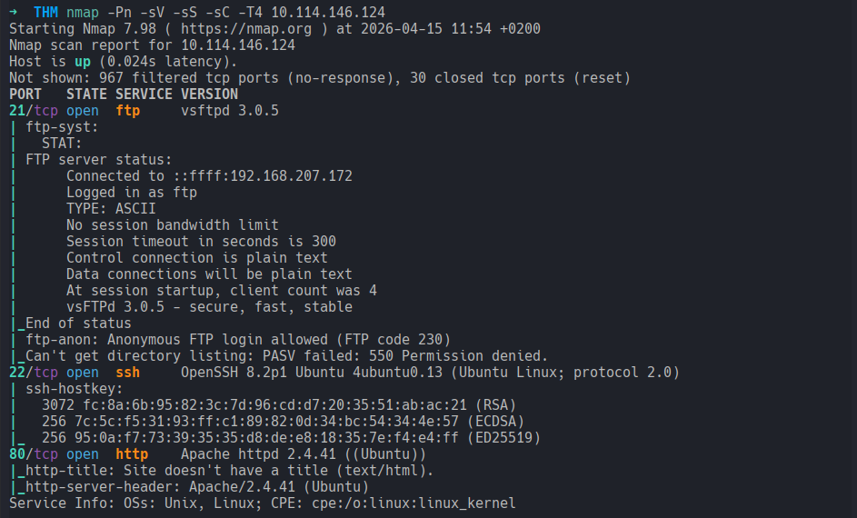
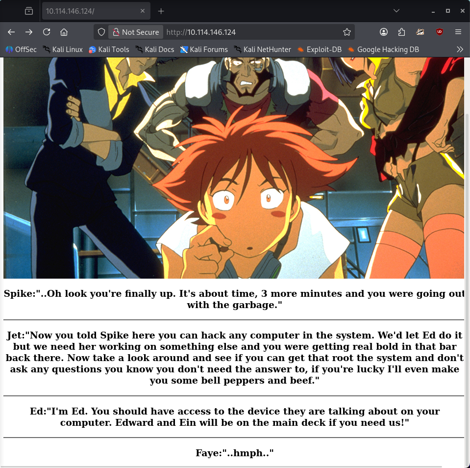
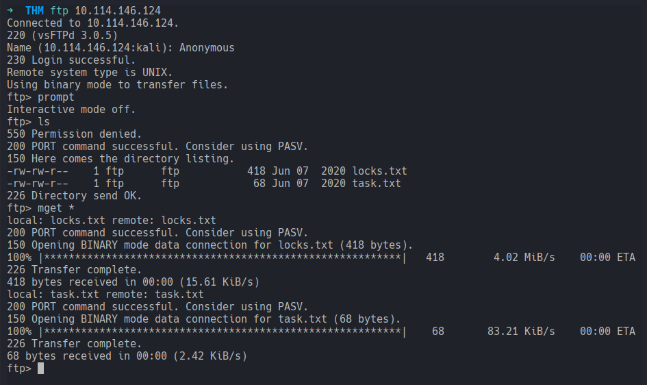
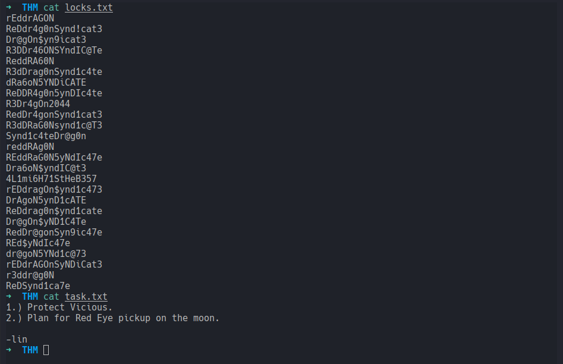
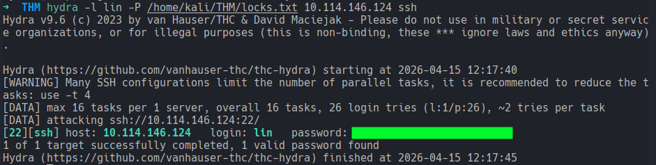
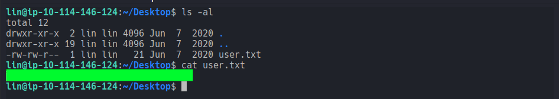
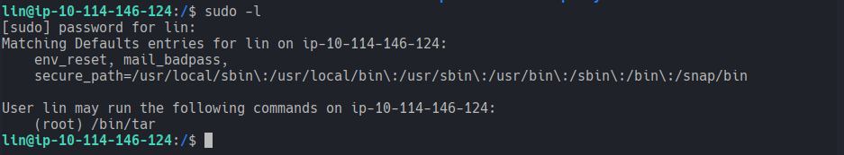
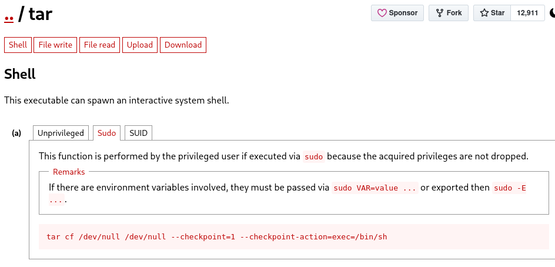
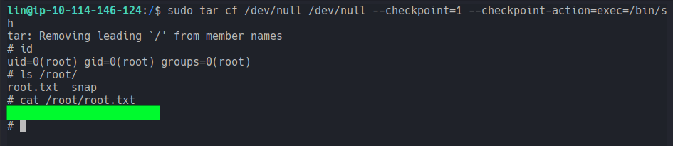

# Bounty Hacker
### You talked a big game about being the most elite hacker in the solar system. Prove it and claim your right to the status of Elite Bounty Hacker!
#### Level: Easy

## Task 1: Living up to the title.
You were boasting on and on about your elite hacker skills in the bar and a few Bounty Hunters decided they'd take you up on claims! Prove your status is more than just a few glasses at the bar. I sense bell peppers & beef in your future! 

### Deploy the machine
The easiest: I deployed successfully the machine.

### Find open ports on the machine
I began by starting a nmap scan and a gobuster directory brute-force. The latter resulted in nothing useful, but the former showed three open ports:

In parallel I visited the website on port 80 and found an image of Cowboy Bebop (peak) and some text, but nothing intersting (source code included):

I continued then with checking the ftp service, since the nmap NSE scan revelaed an `Anonymous FTP login allowed`:

The directory had two textfiles in it, which I downloaded and then inspected:

### Who wrote the task list? 
The file `task.txt` revelead the answer to this question

### What service can you bruteforce with the text file found?, What is the users password? 
The other file, `locks.txt`, looked like a list of passwords, which I used as list for brute-forcing the ssh service (since it was the other service available).
At first I wasn't sure about the user, I don't know why, but I ran the first hydra attack with `Vicious` as user.
This did't work of course. After some thinking I redid it with the user bring `lin` and found her credentials:

### user.txt
After loggin in succesfully, I was so eager to find the flag that I didn't even got a footprint of the system.
And so after logging in I listed the current folder and found the user flag:

### root.txt

I checked then sudo list to find a way to get a root shell:

Since I could run `/bin/tar` as root, I checked GTFOBins for a root escalation possibility through `tar`:

I ran the command and obtained a root shell! After that I double checked my `id` and the content of `/root/`, in which I found the root flag completing this challenge.

[<-- Home](/README.md)