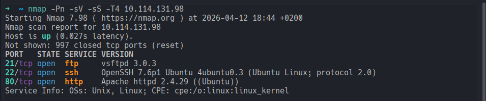
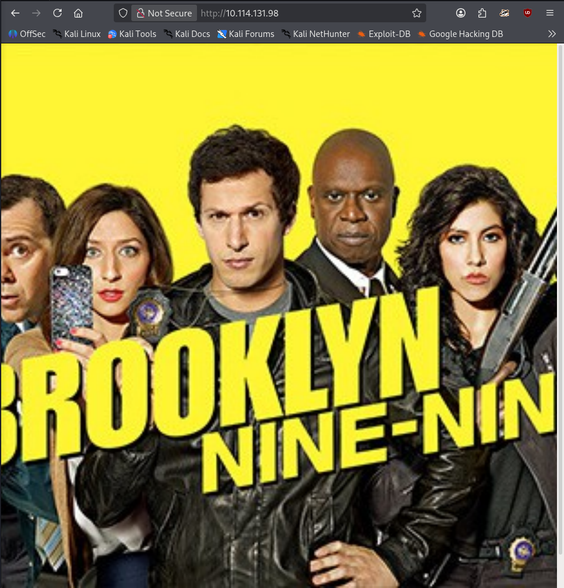
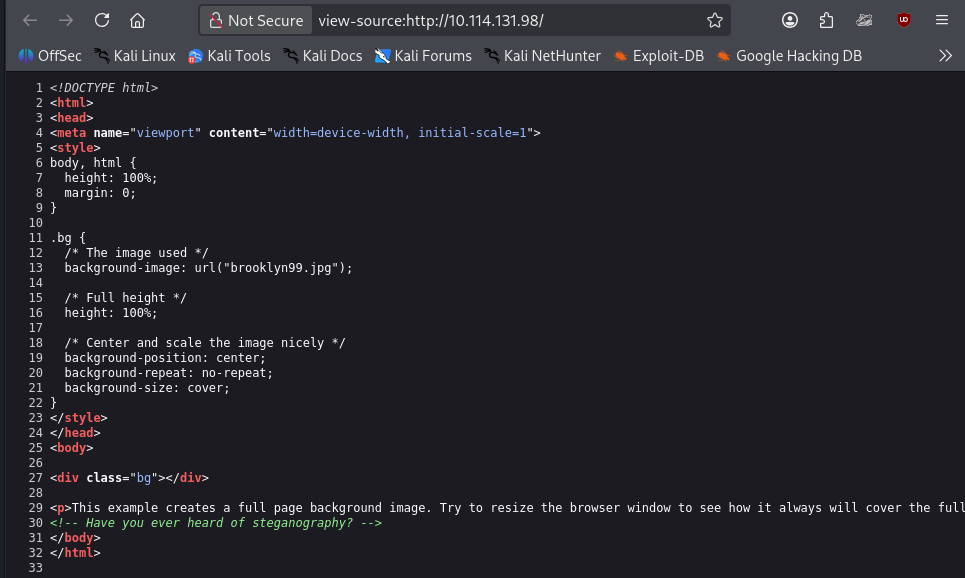
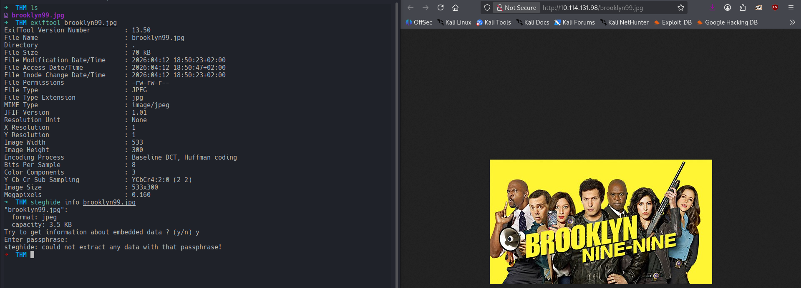
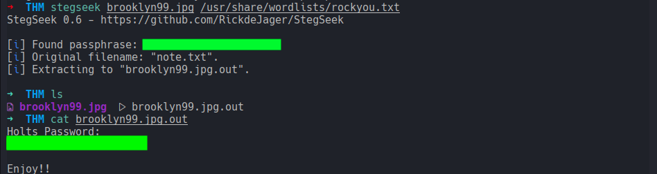
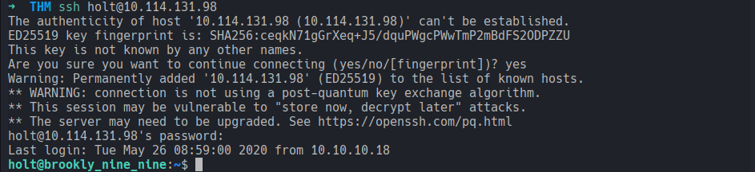
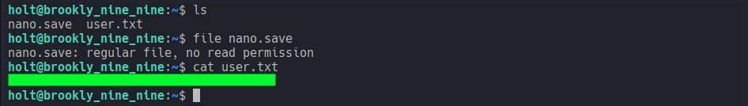
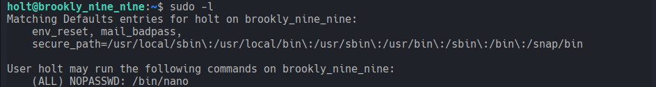
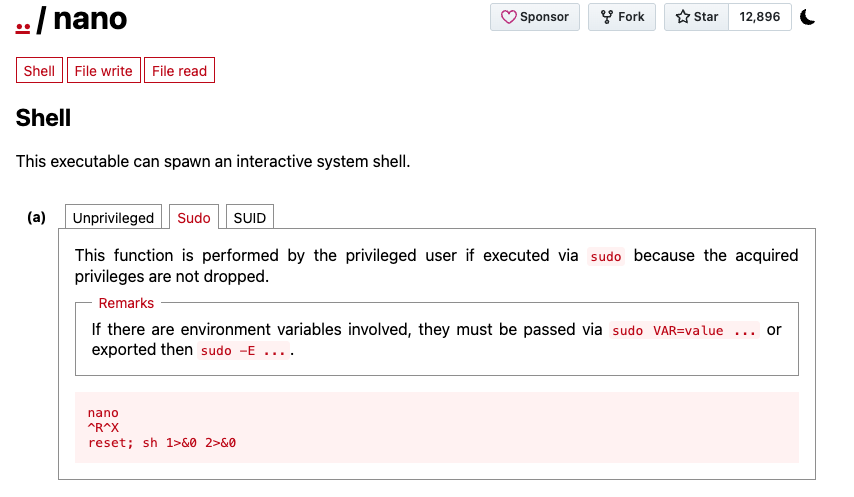
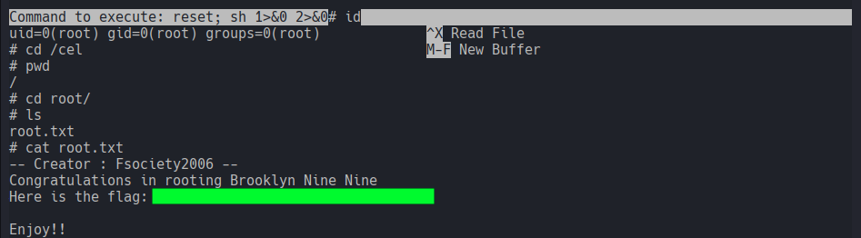

# Brooklyn Nine Nine
### This room is aimed for beginner level hackers but anyone can try to hack this box. There are two main intended ways to root the box.
#### Level: Easy

## Task 1: Deploy and get hacking
### User flag
After deploying the machine, I enumerated the target with Nmap and Gobuster.
The Gobuster scan revealed nothing useful but nmap showed 3 ports open:

Since port 80 was open, I checked the webpage and found a Brooklyn 99 image dominating the screen:

I viewed the html source code and catched a hint about steganography:

Following the hint, I downloaded the image and inspected it:
- The metadata showed with `exiftool` showed nothing interesting
- `steghide` on the other hand, tried to extract some content, but passphrase protected

I tried my luck with `stegseek` and `rockyou.txt` as wordlist and found indeed Holt's password:

Which I used for attempt (successfully) an ssh connection to Holt's account:

After checking the content of my current directory, I found the **User Flag**

### Root flag
For attempting escalation, I gathered information about my current permission with `sudo -l`:

Which showed that I had permissions to run `/bin/nano` as anyone and without entering password.

I headed to **GTFOBins** and searched for nano/shell/Sudo and found the instructions to *evade* to a root shell:
- sudo nano
- Ctrl + R
- Ctrl + X
- and then type `reset; sh 1>&0 2>&0`

I followed this and obtained successfully a root shell allowing me to find the root flag!

Room down!

## What about ftp?
Well, I guess the ftp login was the other way mentioned to solve this room. Infact while reviewing the screenshots, I noticed that the ftp login was an anonymous one! Since I was rolling with the clues found though, I just stayed on Holt's path.

[<-- Home](/README.md)