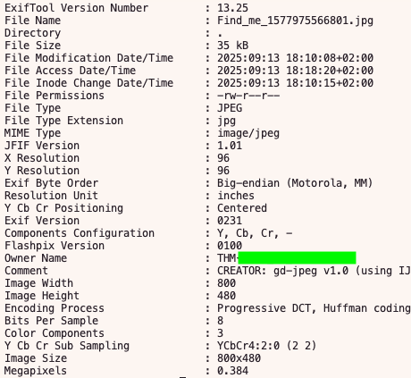
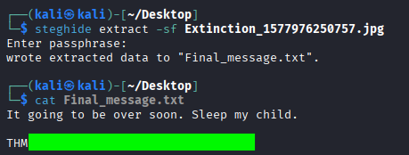
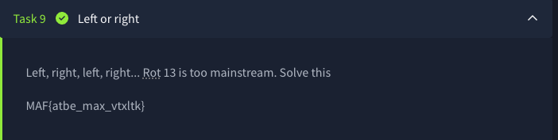
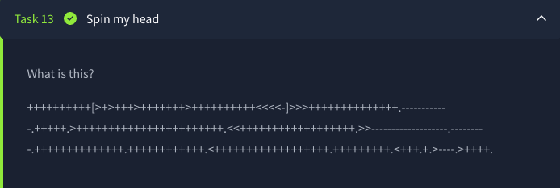
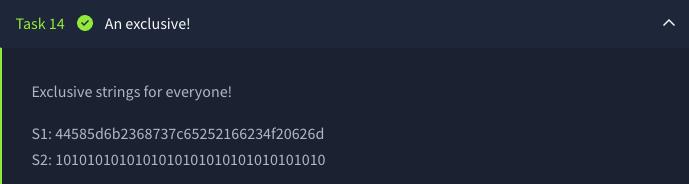
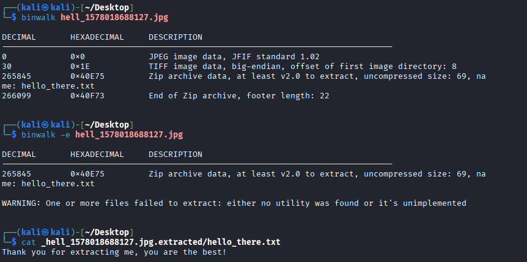
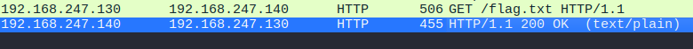

# CTF Collection Vol.1
# Summary
This README is a summary of my experience solving my first TryHackMe CTF Collection (and my first CTF overall).
The goal is to reinforce the knowledge acquired during this challenge.

Overall, this took me way more time than I expected, but it was fun (sometimes frustrating) and helpful for learning new approaches, apps, and techniques.

This room consists of 20 tasks, with each resulting flag being in the following format: THM{some_text}

## Task 2 What does the `base` said?

Task 1 is just the introduction to the challenge.
Following the Task 2 title, this task involves some base.
The placeholder at the end `==` gave me a strong hint for the base64, the hint confirmed this.
I ran in the terminal:
```bash
$ echo <base_sequence> | base64 -d
```

## Task 3 Meta meta

Since the title for this task is Meta meta, the flag is probably in the metadata of the downloadable file.
For this I opted for `exiftool`:
```bash
$ exiftool Find_me_1577975566801.jpg
```
The next flag is right in the `Owner Name`



## Task 4 Mon, are we going to be okay?

Here we are welcomed with `Something is hiding. That's all you need to know.` and a downloadable file.  
First I tried extracting readable content from the image running:
```bash
$ strings Extinction_1577976250757.jpg | less
```
The result was some readable material at the beginning (maybe a hint that the picture was manipulated?) but no flag.  
I took a peak at the Hint section and found out about **steghide**. Not knowing this tool, I did a quick search:

> It turns out, it's a steganography tool used for *hiding data inside other files. It support encryption with passphrase, and extraction.* 
And comes preinstalled on kali linux.

```bash
$ steghide extract -sf Extinction_1577976250757.jpg
```
I was prompted for a passphrase but until now there was none given nor found, so I just pressed enter and it successfully worked. The extracted data was now written in `Final_message.txt` and in it the next flag. 



## Task 5 Erm......Magick

This task was (in the end) fun. It took me way more time than it should have.
There is no given file, string or text. The Title though mislead me quite a bit, since I thought that maybe the solution resided in finding the flag in the previous pic using `magick`. Total waste of time.
In the end I checked the Hint and inspected the page sourcecode just to find the flag right there. 
More funny was, the flag was also findable by highlighting the given phrase `Huh, where is the flag?`

## Task 6 QRrrr

The given file was a QR Code. I scanned it quickly with my phone and the flag revelead itself.
Since already in the terminal, I went with:
```bash
$ zbarimg QR_1577976698747.png
```
...and copy/pasted the flag.

## Task 7 Reverse it or read it?

The downloadable file this time is not an image. I used cat and spotted some readable words but a lot of non rendered characters. After that I decided on `strings` and since we know the flag format I tried using `grep`:
```bash
$ strings hello_1577977122465.hello | grep THM
```
The flag was successfully found. Next!

## Task 8 Another decoding stuff

We are given the string `3agrSy1CewF9v8ukcSkPSYm3oKUoByUpKG4L` to decode. Base64 didn't work. 
The hint then confirmed it was `base58`. Just for knowledge I searched for base58 characteristics and one of the big indicator is the alphabet used. *Visually confusing characters are removed: so no 0 (zero), O (capital o), I (capital i), or l (lowercase L), +, /.*  
Anyway I solved this with an online base58 encoder/decoder, and, knowing it a bit, with python, since I found out there is the `base58` module
```python
import base58

encoded = "3agrSy1CewF9v8ukcSkPSYm3oKUoByUpKG4L"
decoded = base58.b58decode(encoded)
print(decoded)
```

## Task 9 Left or right

Here the answer is given right away but is encrypted. 
It is mentioned that it is not a ROT 13, a known Caesar Cipher, but probably one with just a different shift. 
Since the format is given, I counted mentally how many shifts would take from `MAF` to `THM` and the result was 7. I opened then a web Caesar Cipher encoder/decoder, used it with a shift of 7 and the flag was shown.



## Task 10 Make a comment

`No downloadable file, no ciphered or encoded text. Huh .......`  
By inspecting the HTML code of this box, the flag is right there.

## Task 11 Can you fix it?

`I accidentally messed up with this PNG file. Can you help me fix it? Thanks, ^^`  
This came with a downloadable file. 
The downloaded png file couldnt be opened. I then checked the file type:
```bash
$ file spoil_1577979329740.png
spoil_1577979329740.png: data
```
Something in the file was corrupted. I checked the header of the file with following command:
```bash
$ head -c 16 spoil_1577979329740.png | xxd
# head prints the first part of a file.
# -c 16 --> read first 16 bytes.
# xxd produces a hex + ASCII dump.
00000000: 2333 445f 0d0a 1a0a 0000 000d 4948 4452  #3D_........IHDR
```
The PNG magic number was not shown, so the task was to rewrite the wrong bytes I guess.
First using `xxd` I created a hexdump:
```bash
$ xxd -p spoil_1577979329740.png > hexdump.txt
# -p or --plain for plain continuous hex
```
Then with a text editor I substituted the wrong `2333 445f 0d0a 1a0a` with the right PNG Signature `8950 4e47 0d0a 1a0a` (thanks google!) and after saving, I reversed the corrected hexdump.txt to png:
```bash
$ xxd -p -r hexdump.txt > spoil_1577979329740.png
# -r for reversing
```
Now the png can be opened and the flag is shown within.  

I later searched for a quicker way to do this and it is possible with following command:
```bash
# first a safe copy of the file
$ cp spoil_1577979329740.png spoil_fixed.png

# then the rewriting with dd, a low level file copying tool in Unix/Linux that works at byte level
$ printf '\x89\x50\x4E\x47' | dd \
of=spoil_fixed.png \    # output file to write
bs=1 \                  # block size = 1, byte by byte
count=4 \               # write 4 blocks 89 50 4e 47
conv=notrunc            # don't truncate the file
```
So much learning!

## Task 12 Read it

This task recites: `Some hidden flag inside Tryhackme social account.`  
Through the word pun in the title I guessed Reddit and the hint confirmed it, but this was the only simple thing for this task. 
Finding the hidden Flag itself in the Tryhackme Reddit account was super difficult. It took me quite some time and a lot of searching and scrolling. The name of the post for it is `New room Coming soon!`

## Task 13 Spin my head

At this point the name of the task was reflecting my own state (lmao).  
Anyway for this Task there is a long strings of pure symbols. Upon checking the hint, binaryf*uck, I found out that this is an esoteric form of programming language(!?).  
Fortunately there are plenty of interpreter for this. The decoded message is the next flag.



## Task 14 An exclusive!

Here two strings are given, S1 and S2. I first tried to decode the strings on their own but this was a dead end. I then checked the hint section with this result `S1 XOR S2`, which I solved using an online tool.



## Task 15 Binary walk

`Please exfiltrate my file :)`  
This is the next task with a downloadable file, which is a JPG file. Zero clues in my mind. I checked the hint section and it referred to `binwalk`. Still having no idea about this, I searched for it and found out that
> it's a tool that *scans a file and looks for signatures of embedded files by reading byte by byte, in search of known headers. If present can extract them*. 

I checked and it's preinstalled on Kali linux, so I used the VM and then:
```bash
$ binwalk hell_1578018688127.jpg 
```
Which revealed the presence of a file named `hello_there.txt`. In order to extract this file I went with:
```bash
$ binwalk -e hell_1578018688127.jpg
# -e for extracting the embedded files 
```
The extracted files were then placed in a folder named `_hell_1578018688127.jpg.extracted`, the flag in the `hello_there.txt`



## Task 16 Darkness

We are greeted from this task with `There is something lurking in the dark.` and an image that is just pure darkness.
For this there was probably a technical way to find the flag (later in the hint I read `stegsolve`).  
I just messed with Contrast, Brightness and Saturation and the flag was quickly visible.

## Task 17 A sounding QR

One of the simplest task so far.  
By scanning the QR Code I landed in soundcloud and listened for the flag.  
The format of the flag is listed in the Task Description:  
`How good is your listening skill?
P/S: The flag formatted as THM{Listened Flag}, the flag should be in All CAPS`

## Task 18 Dig up the past

This was almost straightforward. Everything is given.  
> Sometimes we need a 'machine' to dig the past  
Targetted website: https://www.embeddedhacker.com/  
Targetted time: 2 January 2020

The website itself is a dead end but since "we need a machine to dig the past" and a specific day is given, I remembered about the [Wayback Machine](https://web.archive.org/). I then searched for the website in the Wayback Machine and searched for the snapshot of the Targetted time. In it, down the page, there is a THM flag post with the flag under it.

## Task 19 Uncrackable!

Here the flag is given from the beginning but is ciphered. The flag format is also there but we miss a decipher key.
> Can you solve the following? By the way, I lost the key. Sorry >.< 
MYKAHODTQ{RVG_YVGGK_FAL_WXF}  
Flag format: TRYHACKME{FLAG IN ALL CAP}

Looking at the flag format, I started checking the shifts for the word TRYHACKME with the ciphered one, and found out that the shifts were constant every three characters. So it was like a multiple caesar cipher, kinda. Since it was taking too much brain power, I checked the hint and found out that this is called a Vigenere Cipher (something new again, lol).
I then used an online decoder that cracked it and thus obtaining the flag.  
The cipher key in the end was multiple `THM` 

## Task 20 Small bases

I had here no clue at all, I went straight for the hint section which gave following hint: dec -> hex -> ascii.  
So the given string needed to be converted two times.
At this point I was lazy and searched for an online converter that successfully worked! :D  

## Task 21 Read the packet

The title itself tells what to do. I downloaded the `.pcapng` file and opened it with Wireshark. I started scrolling but nothing catched my eye. I then filtered per HTTP protocol and, at the end of the list, there were two curious entries. I checked them both and found the last flag.



And with this I finished this first Challenge (and lots of coffee)!