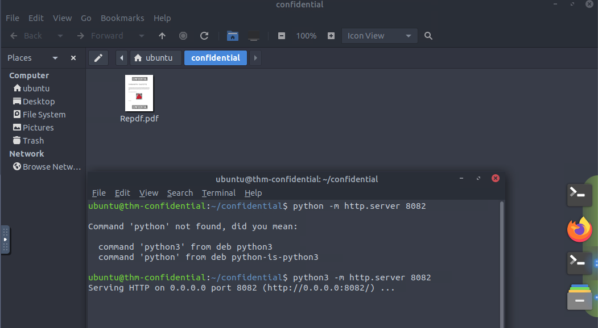
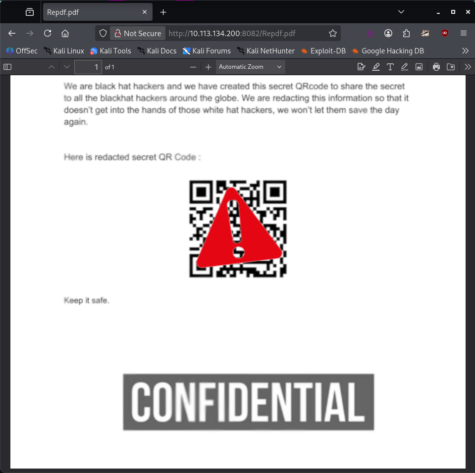
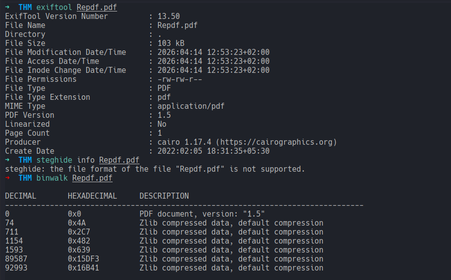
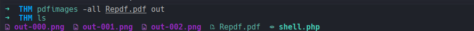
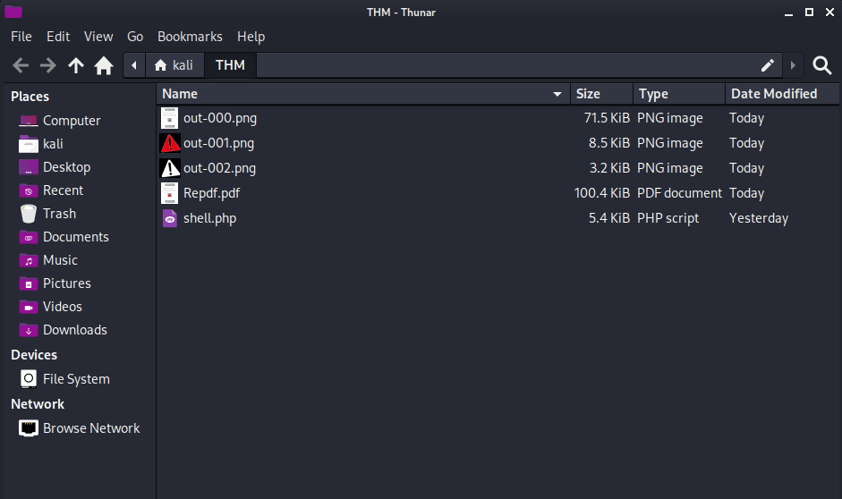
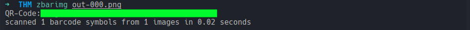

# Confidential
### We got our hands on a confidential case file from some self-declared "black hat hackers"... it looks like they have a secret invite code.
#### Level: Easy

# Task 1: Confidential
We got our hands on a confidential case file from some self-declared "black hat hackers"... it looks like they have a secret invite code available within a QR code, but it's covered by some image in this PDF! If we want to thwart whatever it is they are planning, we need your help to uncover what that QR code says!

## Uncover and scan the QR code to retrieve the flag!
Starting the room was launching automatically an Attack Box. 
Since it was a bit *clunky* working with it, I started a python server within the pdf folder:

... and downloaded the pdf file directly into my kali machine:

I started by checking it with exiftool, steghide and binwalk but found nothing interesting:

From there, I did some research and found a tool, that is part of the `poppler-utils`, called `pdfimages`:  
> pdfimages is an open-source command-line utility for lossless extraction of images from PDF files. pdfimages can extract images embedded within PDFs as PPM/PBM, PNG, TIFF, JPEG, JPEG2000, and JBIG2 files and can convert and output images to any of the formats it can extract. (Wikipedia)

So it opens a pdf almost like a container and extracts the images, which sounded like the right tools for the job.
After installing the `poppler-utils`, I tried id right away:

It worked like a charm and extracted all the images present in the pdf:

After that I could finally scan the QR Code with my phone and saw the flag. This was for copy/pasting not the best though, so I used `zbarimg` directly from terminal:

[<-- Home](/README.md)

