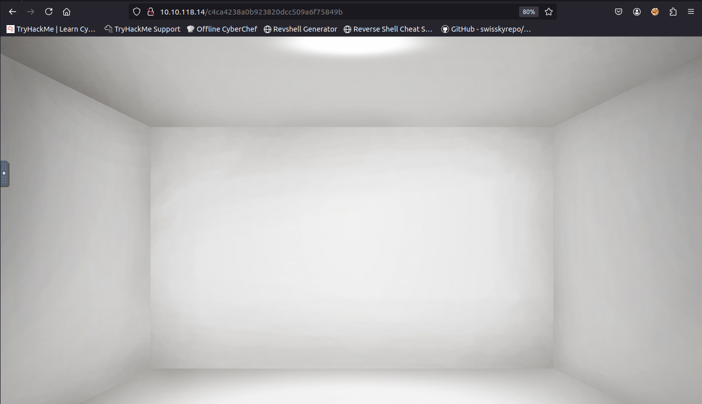
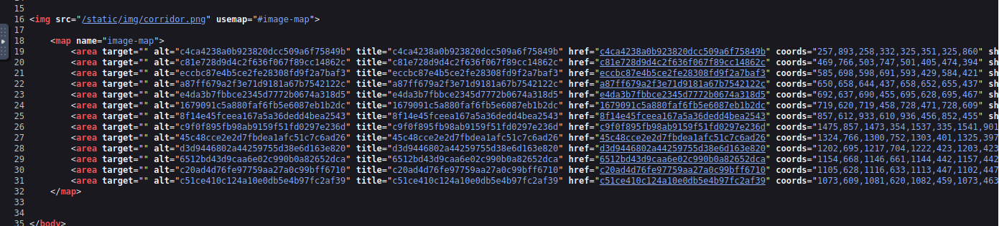
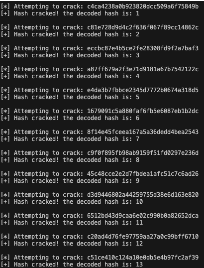
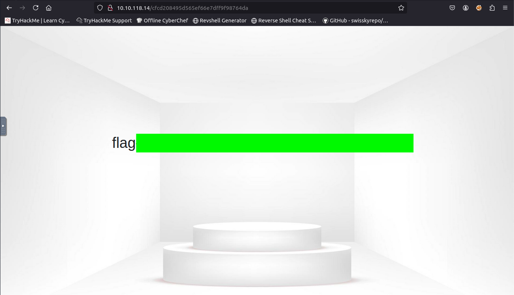

# Corridor
# Summary
As hinted in Task 1, this room revolves around IDOR vulnerabilities and hashes. To tackle it, I relied on a couple of Python scripts I had written some time ago. That said, everything could also be solved using an online tool like https://www.dcode.fr/en 

> [!NOTE]  
> A small disclaimer: the Python scripts I used here are not yet optimized, as I’m still acquiring knowledge. However, for learning purposes and for easier CTF challenges, they serve their purpose.

## Task 1 Escape the Corridor 
> You have found yourself in a strange corridor. Can you find your way back to where you came?
>
> In this challenge, you will explore potential IDOR vulnerabilities. Examine the URL endpoints you access as you navigate the website and note the hexadecimal values you find (they look an awful lot like a hash, don't they?). This could help you uncover website locations you were not expected to access.

After navigating to the machine's address through Firefox, I was presented with the corridor and its 13 doors:

The rooms were all empty, nothing inside...

... BUT, as previously suggested, this room revolves around ***IDOR vulnerabilities and hashes***.  
After pointing to every door, I could see the address of the room and, inside it, a string that looked a lot like a hash.

Starting from the left side, I noted down the first three hashes and used a simple Python script (that I already had) to guess (solely on hash length) the hashing algorithm.
The result was **MD5**. I then checked the page source, found the rest of the hashes, and noted them down in a file.

Knowing the algorithm, I used an old [Python script](./Scripts/hash_cracker.py) I had, to atttempt cracking all the hashes through a dictionary attack (I know I could have used hashcat, but I was eager to use, for this purpose, my lightweight implementation, lmao).  
The results where the numbers 1 through 13.

At this point, since in programming we usually start counting from 0, I used another [small python script](./Scripts/hash_string.py) (it was basically an old 3-Scripts project revolving around hashes) to hash the number `0` with `MD5`, obtaining `cfcd208495d565ef66e7dff9f98764da` and gave it a try.
So I put it then in the URL like `machine_address/cfcd208495d565ef66e7dff9f98764da` and the flag jumped right in my eyes!

**And that’s it, quick and dirty.  
Another room down!**
