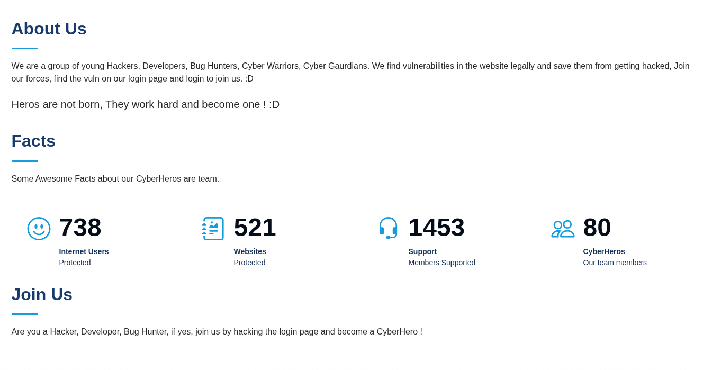
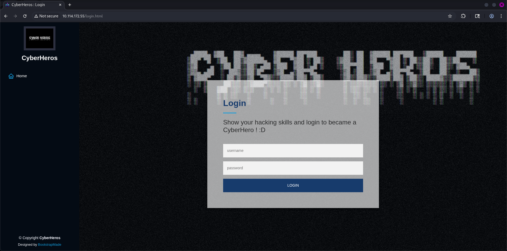
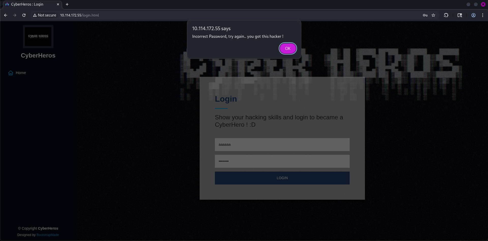
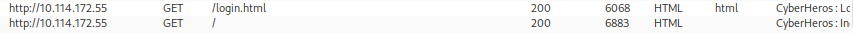
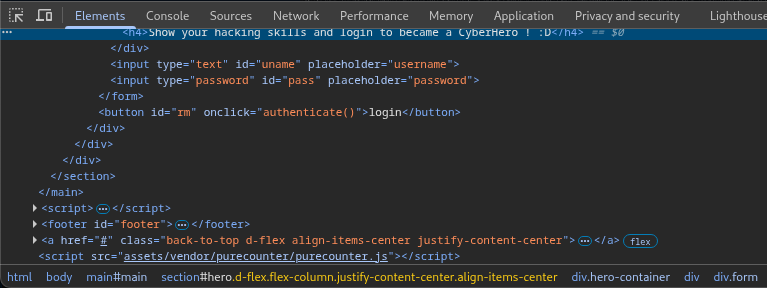
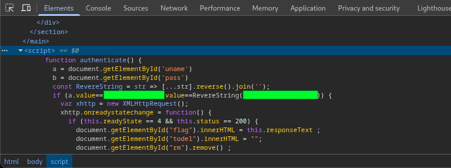
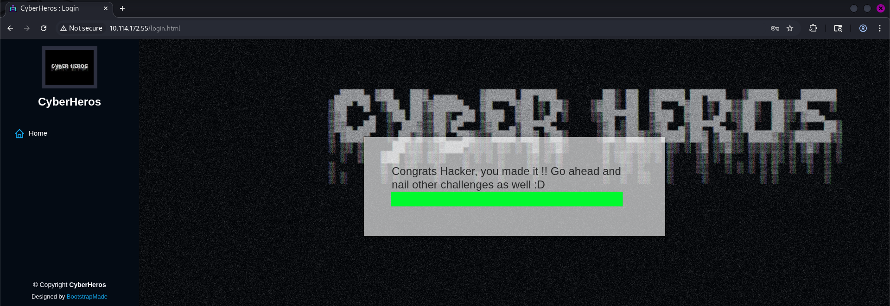

# CyberHeroes
### Want to be a part of the elite club of CyberHeroes? Prove your merit by finding a way to log in!
#### Level: Easy

## Task 1: Cyberheroes
As usual I performed a nmap scan and launched gobuster:
- Nmap revelead two ports open: 22, 80
- gobuster found standard paths but nothing juicy

I went on with the website, which had three sections: **Home, About and Login**.  
The **About** page dropped a hint in the bottom section *Join us*:

So the *...by finding a way to log in!* from task refers to the website login.

I tried non existent credential to check the behaviour of the login form, and the error was *notified* through a javascript alert:

I opened Burpsuite and confirmed that the credentials check was happening into the frontend (there was no request to intercept).

Upon inspecting the login box elements (in the dev tools), I noticed an `authenticate()` function:

By scrolling a bit further down, I found the `authenticate()` script and some hardcoded credentials:

I entered those credentials and revealed the task flag!

[<-- Home](/README.md)