# Easy Peasy
### Practice using tools such as Nmap and GoBuster to locate a hidden directory to get initial access to a vulnerable machine. Then escalate your privileges through a vulnerable cronjob.
#### Level: Easy

## Task 1: Enumeration through Nmap
### How many ports are open? 
### What is the version of nginx?
### What is running on the highest port?

I started by scanning the address with a quick SYN nmap scan and found only port 80 open. I checked it aggressively, `-A` and it was still port 80 only.

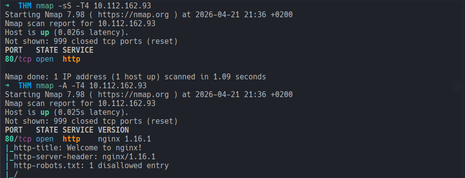

Well I then remembered that if the port flag isn't set, not all ports are scanned. I therefore used the same approach:
- SYN scan specifying all ports, `-p-`:

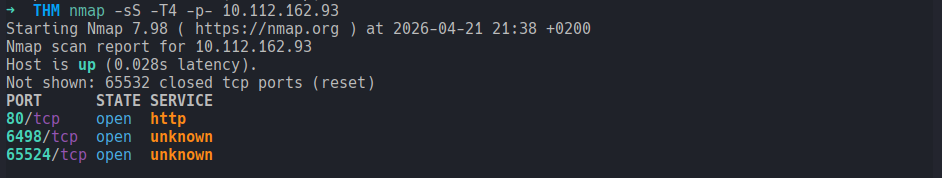

After discoverying three ports in total, I ran the aggressive scan only against those and was able to complete Task 1.

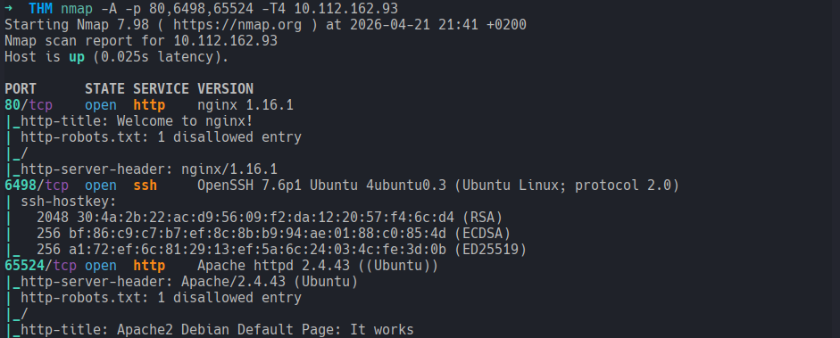

## Task 2: Compromising the machine
### Using GoBuster, find flag1
Going further, I ran Gobuster to find possible hidden paths and potential clues for flag1. The first iteration found two interesting paths, `/hidden` and `robots.txt`:

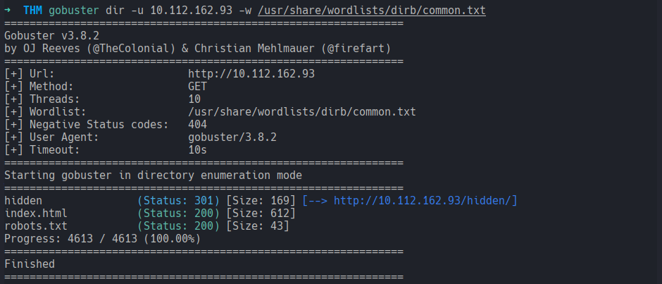

`robots.txt` revealed nothing, BUT the other path revelead an *eerie* image from kinda an abandoned warehouse and a door.

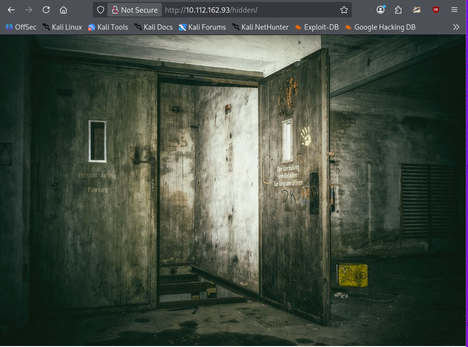

No clues in the source code. I went on brute forcing this new path and found indeed another hidden path:

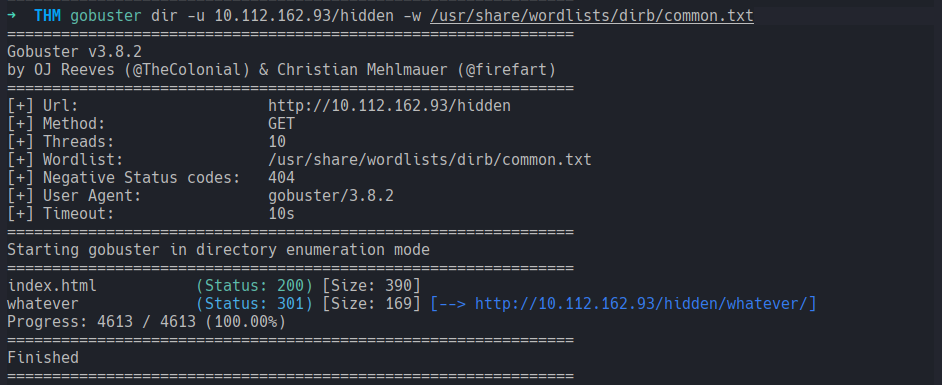

Upon visiting it, an image was showed with the title *dead end*:

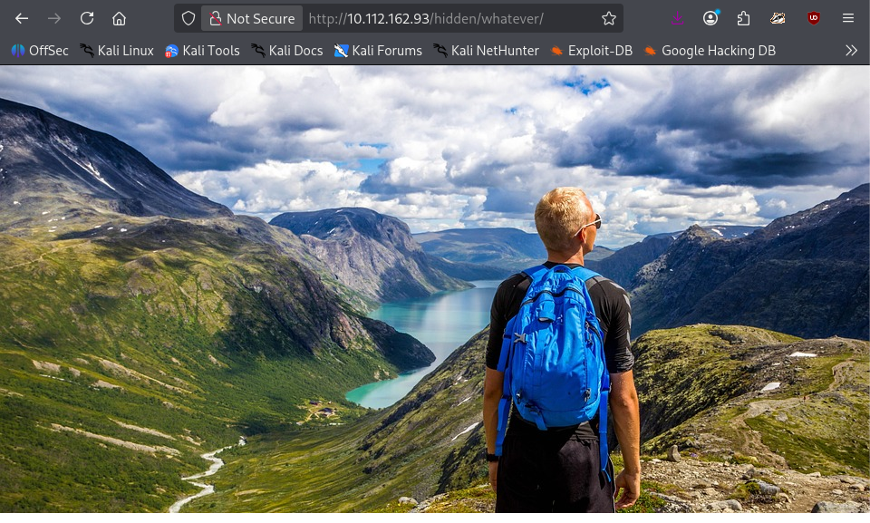

Within the source code though, a clue was left:

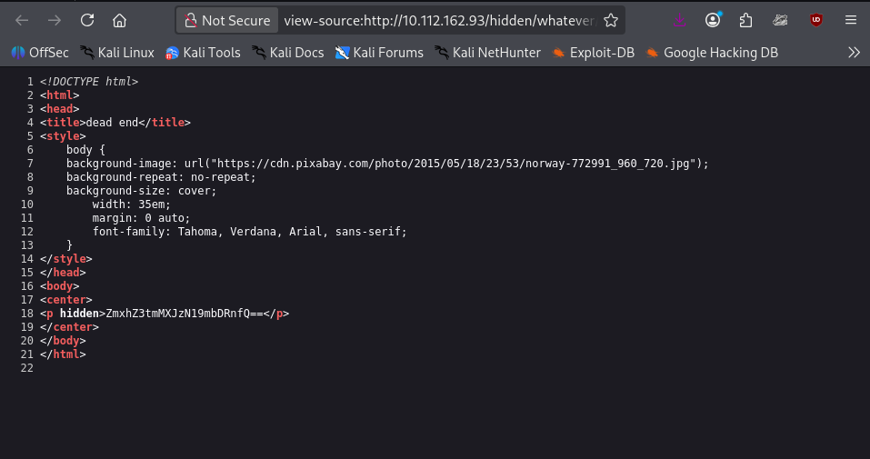

The padding at the end of the screen hinted at `base64`, so I decoded it in the terminal and revealed flag 1!

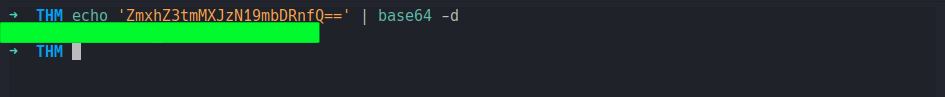

Not having immediate clues to go on, I attempted another instance of gobuster against the last discovered path, but with no results.

### Further enumerate the machine, what is flag 2?
Time to check the high port discovered earlier. The homepage located at this port was the default Apache 2 welcome page.

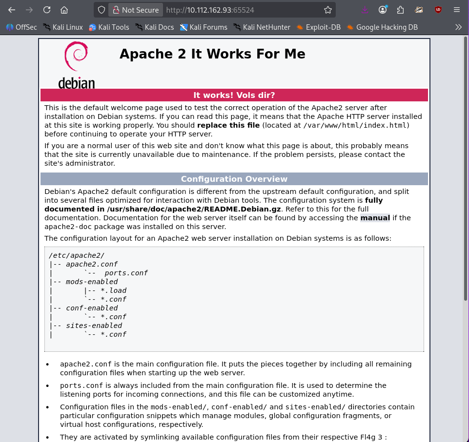

Seeing nothin unusual, I launched gobuster against it and only found `/robot.txt`:

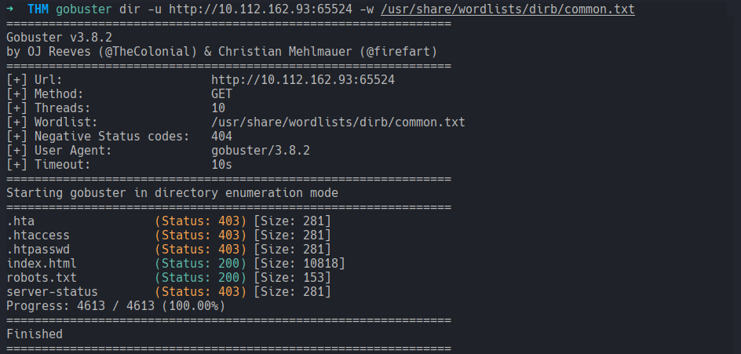

This time `/robot.txt` was interesting:

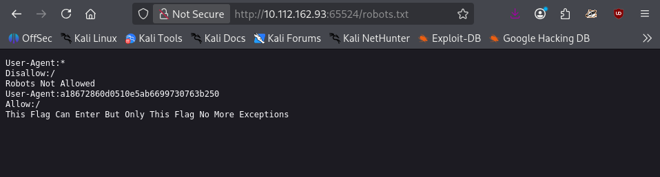

Based on the length of the shown hash, it looked like MD5, which was confirmed by `hash-identifier`.
Here the things became a little frustrating, I tried cracking the hash in several ways, offline and online but with negative results.
Having no luck, I left this at the side and continued looking for further clues.

### Crack the hash with easypeasy.txt, What is the flag 3?
I went back to the Apache default page and looked at it again in search for clues. 
Unexpectedly this was fruitious, since flag 3 was *sitting* there in plain sight within a paragraph:

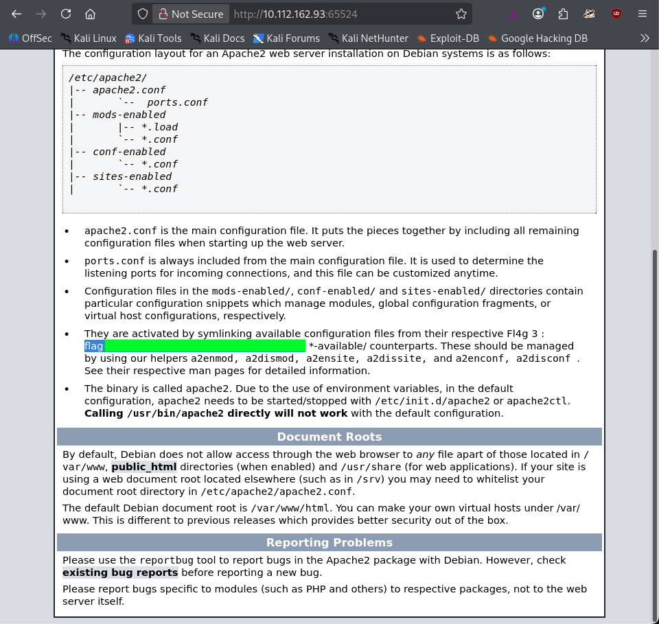

It looked so integrated in the text, that was so easy to overlook!!

### What is the hidden directory?
While at it, I checked the source code of this page and found an interesting clue, another encoded string:

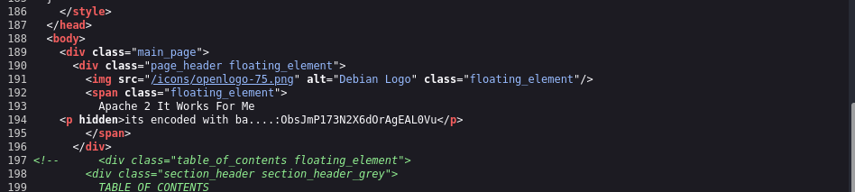

The line said `its encoded with ba....:string`, so it was some sort of base. For this I went to cyberchef and discovered that the encoding was `base62`. The next hidden path was revealed:

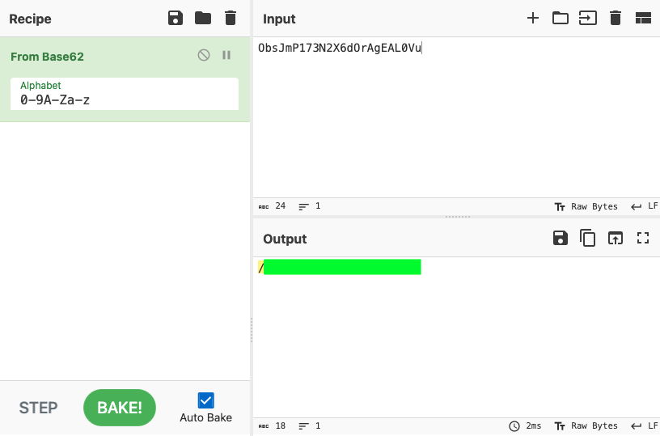

### Using the wordlist that provided to you in this task crack the hash, what is the password?
Navigating to it, a page with a matrix-like background was shown. In it a picture:

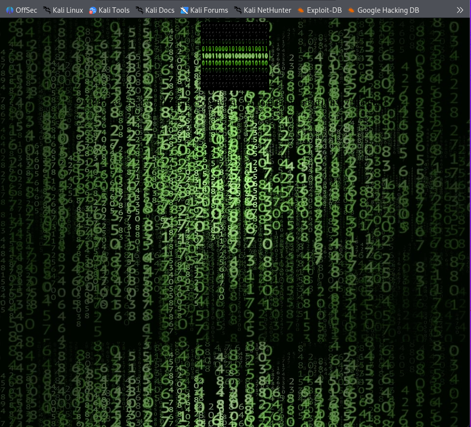

...and a long hash, which I identified as a possible SHA-256 but with several possible variants:

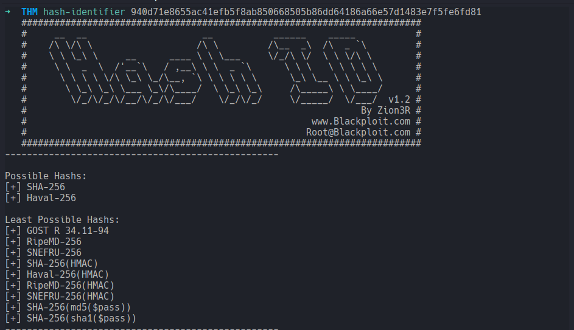

Up to this point, this was the second hash I found and I remebered that I still had one in a note to decode.

### Further enumerate the machine, what is flag 2? (Part 2)
I jumped online again to try to decode the hash and after some tries I finally found one that decoded it, `md5hashing.net`:

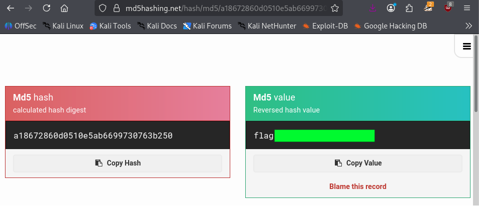

Flag 2 finally found!

### Using the wordlist that provided to you in this task crack the hash, what is the password? (Part 2)
Back on track to the *Matrix* page: having an image and a hash, I started to think that the picture had some embedded data, to which the decoded hash would be tha passphrase to open it. I tried a `john`and a `hashcat` instance for cracking the hash, with the given Task 2 Wordlist, with no results. This was probably a specific encoding algorythm or I did something wrong while trying. 

To shorten the time, I gave `stegseek` a try, passing the given wordlist and, oh my, it worked flawlessly! The embedded data extracted showed potential ssh credentials, with the password binary encoded:

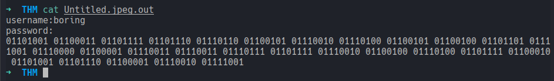

### What is the password to login to the machine via SSH?
Quick jump to Cyberchef, and, decoding from binary, I obtained the password:

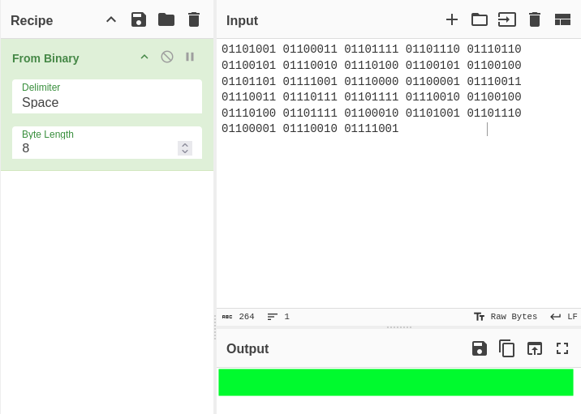

### What is the user flag?
I successfully logged in through ssh at the higher ssh port and I was greeted with a strange message. Not gonna lie, this pressured me a bit to be quick indeed! I checked my `id` and and after listing the content I found the `user.txt` flag:

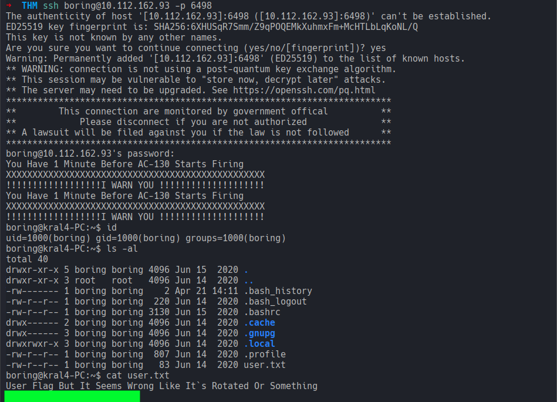

As described though, the flag *Seems Wrong Like It's Rotated Or Something*. So I switched again to cyberchef and tried decoding the flag using a Ceaser Cipher (ROT13), which worked!

### What is the root flag?
`sudo -l` wasn't accessible for the `boring` user, so I checked for SUID files:
```bash
find / -user root -perm /4000 -type f 2>/dev/null
```

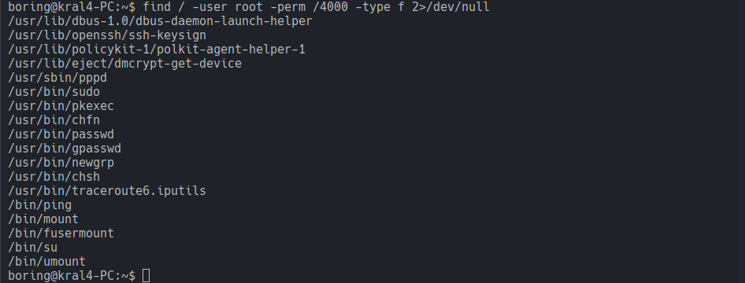

This found nothing interesting too, and the room description already hinted at a vulnerable cronjob, so I checked them:
```bash
cat /etc/crontab
```

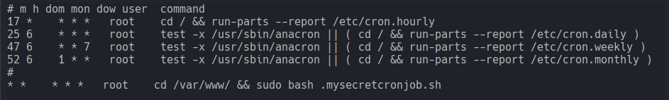

In it I found a curious entry run as sudo called `.mysecretcronjob.sh`. I checked the content of this file and it had the bash shebang and under it a comment `# i will run as root`.

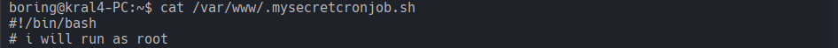

I had some possibilities, the quickest I thought about was a local backdoor (same as in the room LazyAdmin). I confirmed that I had permit to write on the `.mysecretcronjob.sh`, and I proceeded with following steps:

- changed the content of the `.sh` file:
```bash
echo "cp /bin/bash /tmp/rootbash; chmod +s /tmp/rootbash" > /var/www/.mysecretcronjob.sh
```
- double checked the process worked, which it did
- fired `/tmp/rootbash -p` (-p to maintain SUID permit) and my prompt changed to `#`, confirming I was root
- I checked my identity, and, as last, I listed the content of `/root/` and found the root flag!

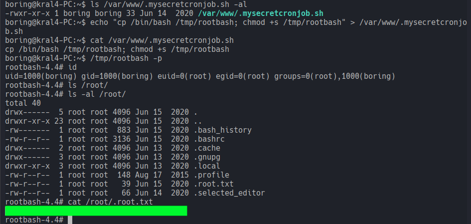


[<-- Home](/README.md)