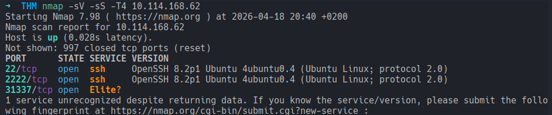
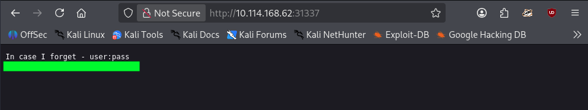
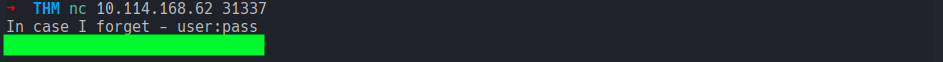
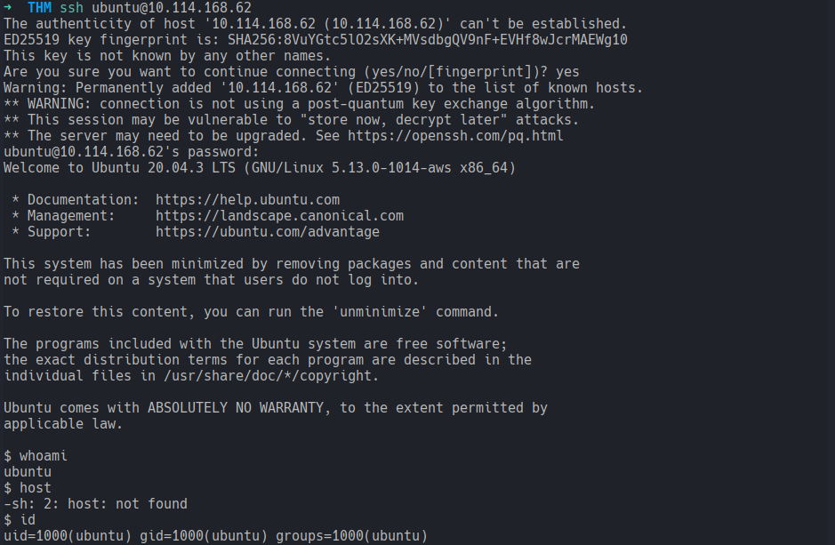
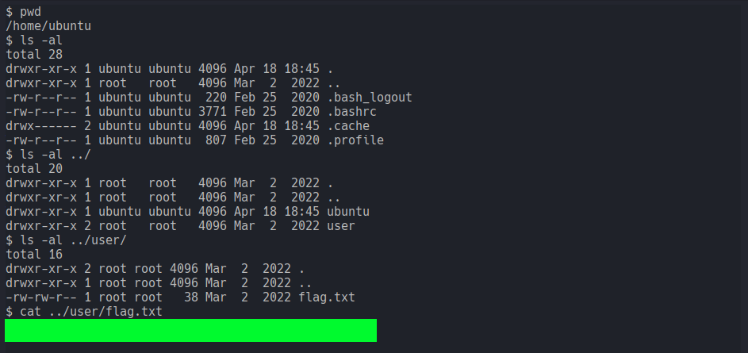

# Intermediate Nmap
### Can you combine your great nmap skills with other tools to log in to this machine?
#### Level: Easy

## Task 1: Intermediate Nmap
You've learned some great nmap skills! Now can you combine that with other skills with netcat and protocols, to log in to this machine and find the flag? This VM MACHINE_IP is listening on a high port, and if you connect to it it may give you some information you can use to connect to a lower port commonly used for remote access!

### Find the flag!
I started this room as a quick easy room before going to sleep, but it turned out to be very easy and very quick. I'm gonna probably squeeze another one.

Anyway, I started with a nmap scan right away and probed for status and service to have a first look:

This revealed three open ports: 22, 2222 and 31337. The first two were running both SSH. The last one had a *weird* fingerprint.  
I investigated this last service by navigating to it in the browser, where I found a credentials reminder in *user:pass* format:

To double check, I used `netcat` to perform a banner grab on the port, which confirmed the same credentials:

I then continued by attempting a ssh connection (on standard port first first), using the found credentials.  
The connection was successfully established:

After checking my id, I snooped around in the `/home` directory and found the flag in `/home/user/`:

[<-- Home](/README.md)