# LazyAdmin
### Easy linux machine to practice your skills
#### Level: Easy

## Task 1: Lazy Admin
### What is the user flag?
As always, I started with a nmap scan; first a simple SYN scan, and then an aggressive scan against the two discovered port:

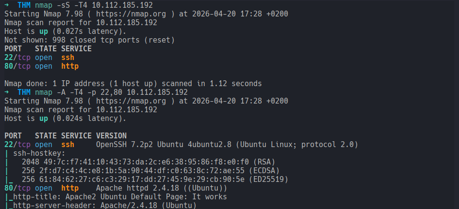

For the next step, I started a brute-force discovery with Gobuster:

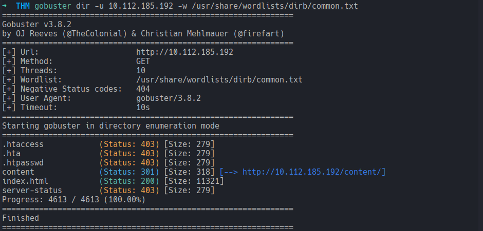

The results weren't that many, so I started first by checking the server address, which showed an *Apache2 Ubuntu Default Page*:

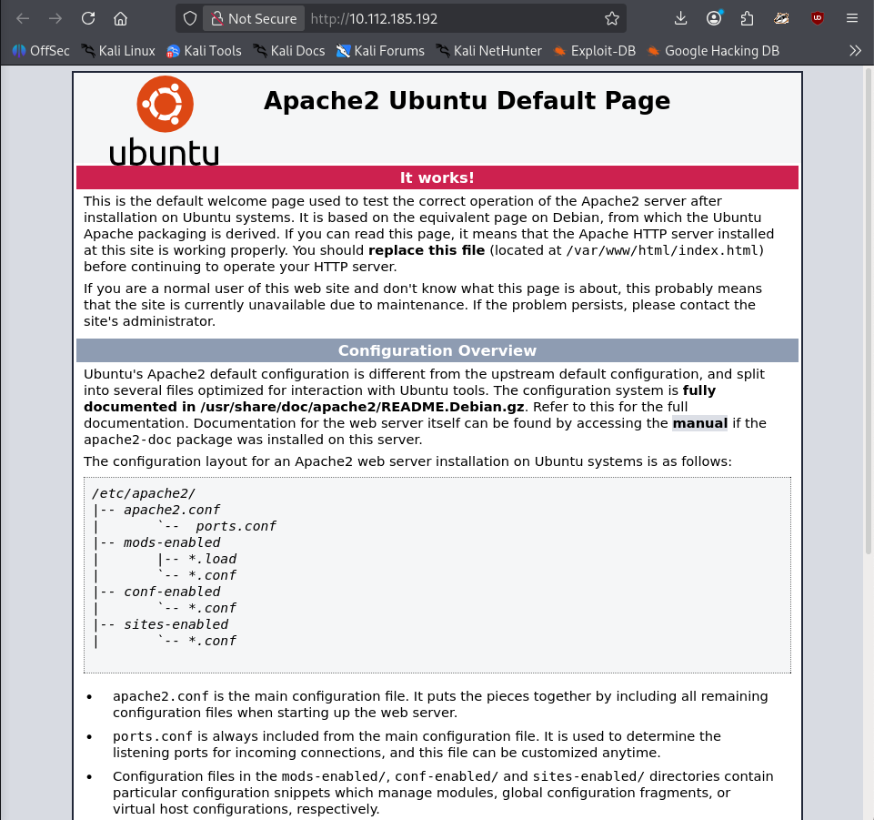


...and then the path `/content`, which revealed what it seemed to be an Homepage for a website in building process, closed at the moment:

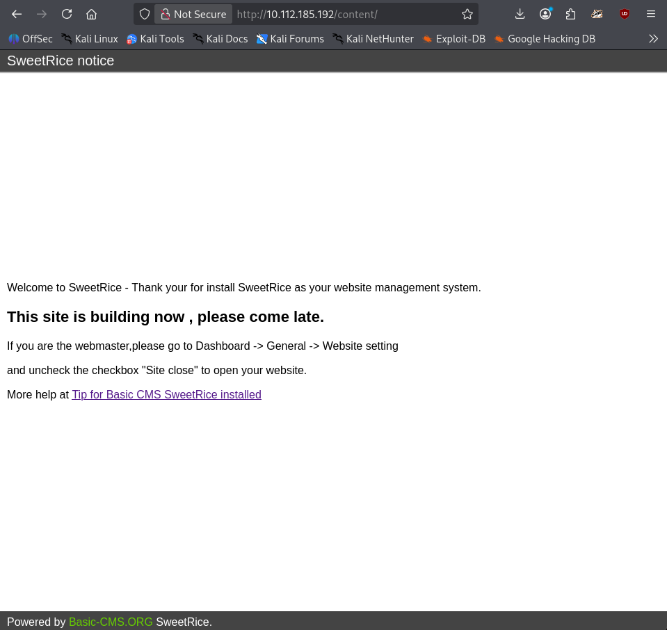

Still not that much information. I continued then with another Gobuster instance with */content* as the target. This got me few results but really interesting ones:

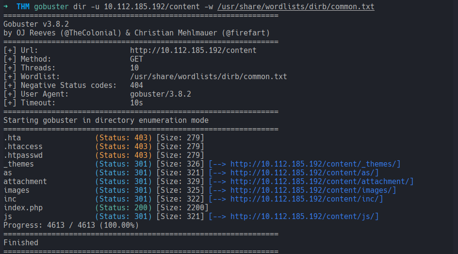

I started right away checking them one after the other:

1. `/content/_themes`: To my knowledge, nothing interesting yet, just the theme pieces:

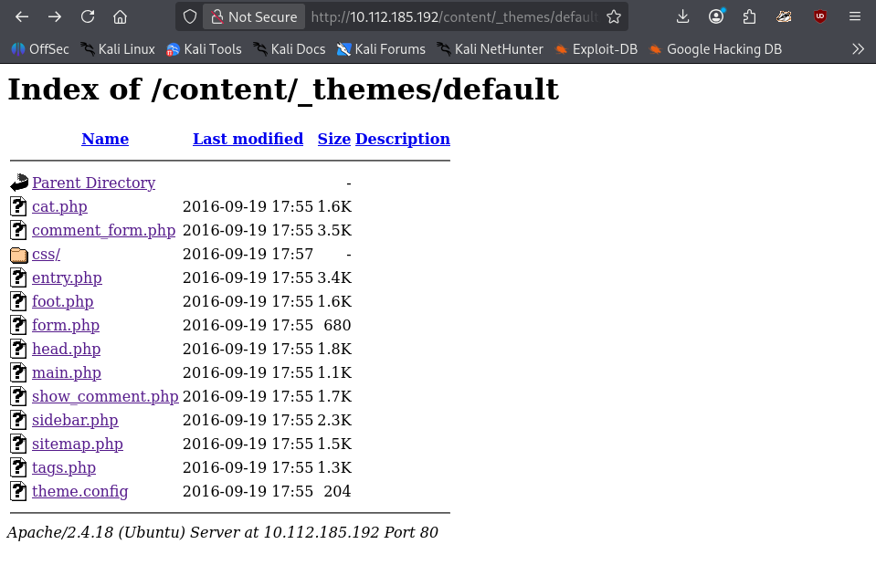

2. `/content/as`: A login form, BINGPOT! I got no credentials but it was an entrypoint. Saved for later!

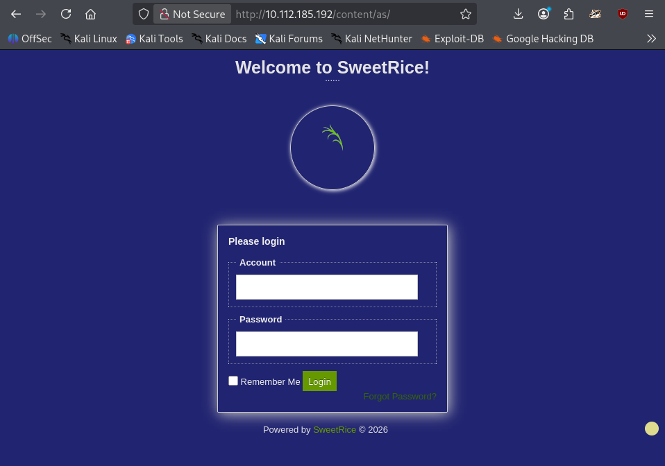

3. `/content/attachment`: This was empty (yet!)

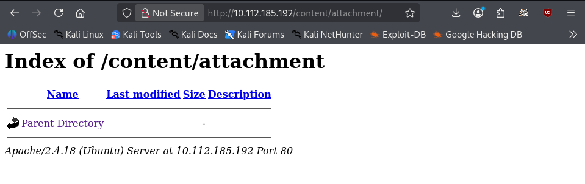

4. `/content/images`: This was only images, I forgot to screenshot it :/

5. `/content/inc`: for *include*? This was by far the juiciest! It had lots of files, and a couple to download:

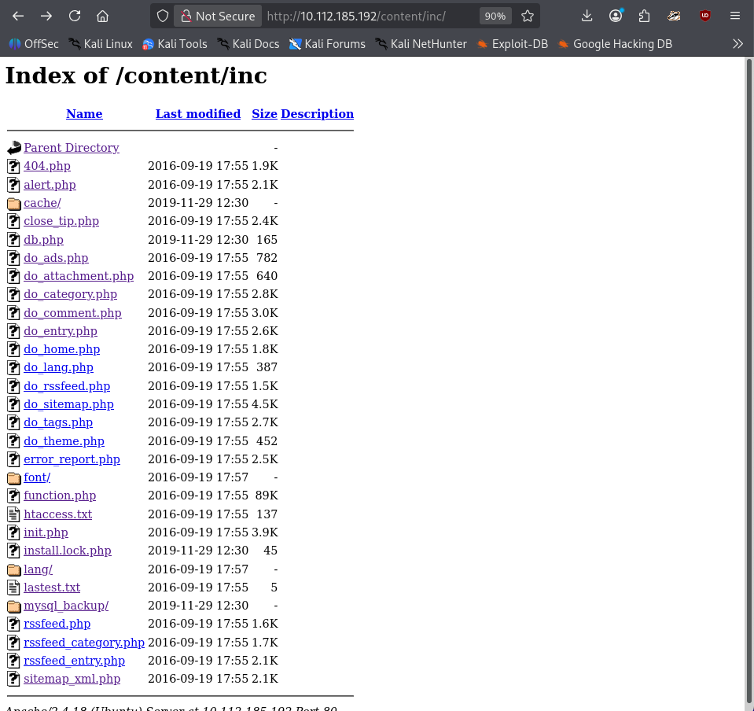

BUT what catched my eyes whas the `mysql_backup` directory, because it had `sql` file within, therefore potential new clues!

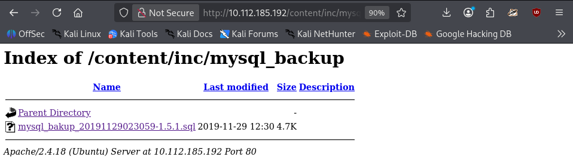

Upon visualizing the mysql_backup content with `cat`, I found an interesting line, with interesting words around. This looked like credentials: `admin:manager`, `passwd:hash`:

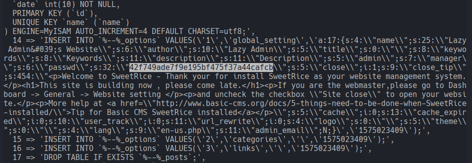

Based on the length looked like an md5, but I ran a quick identification anyway, and it was confirmed:

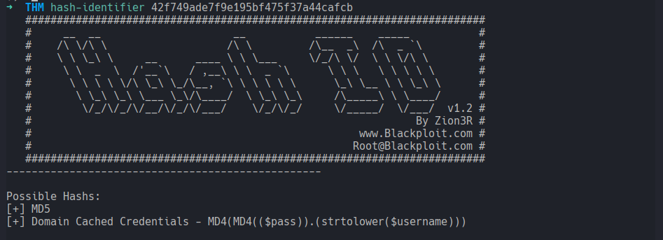

I attempted the cracking with hashcat:

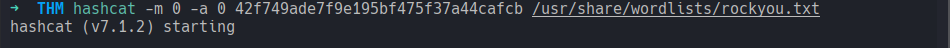

And it worked!

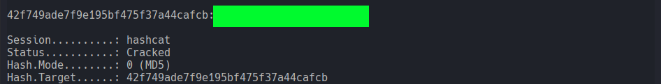

With credentials in my possess, I navigated to to the login page at `/as` and logged in successfully.  
Welcome to the Dashboard:

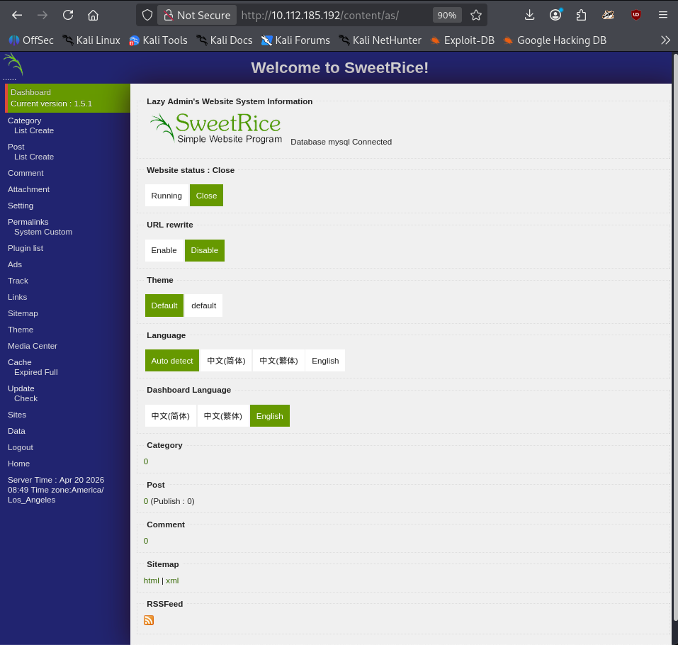

As first, I changed the Website Status from Close to **Running**.

From there the possibilities to exploit this were probably several, so I started checking the sections on the sidemenu for a possible webshell upload point. In the middle of it, while in the flow (lol), the server stopped working and I needed to restart the room.

I identified a couple of potential section to upload the reverse shell. For this attempt I choose the Media Center. From the look of it, there was no explicit filter, but, reminiscing other rooms, I decided to change the shell format from to upload `.php` to `.phtml`.

And then:  
Browse-->`Shell.phtml` selected-->Done  
File successfully uploaded and listed right away in the Media Center:

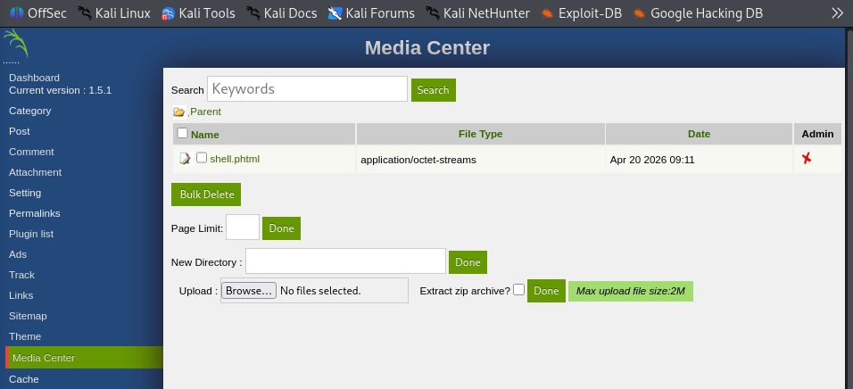

I started a `netcat` listener in the terminal and then clicked on the file in the Media Center:

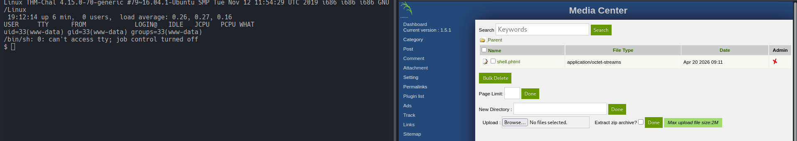

Connection Established, **I'm in!**

As usual, I verified my foothold with `id` and `whoami`, then checked (positively) for `python` to stabilize my shell.
Afterward I spawned a python pseudo-terminal, and at last gave a peak at `sudo -l`:

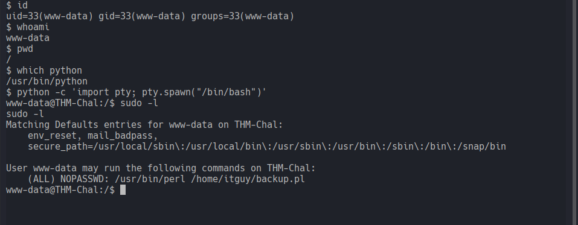

The sudo list result looked funny, but first the user flag.  
I checked `/home`, found a user and, within the directory, the user flag.

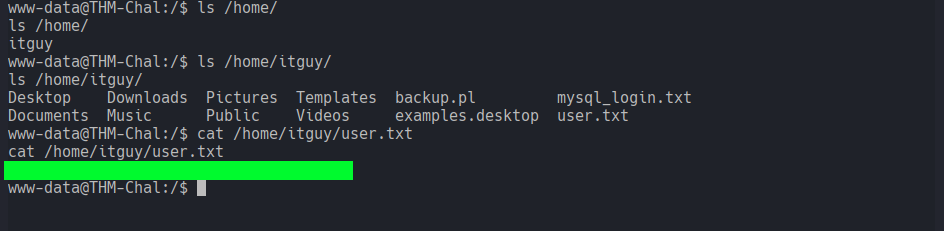

### What is the root flag?
For the root flag, sudo list showed following:
```bash
User www-data may run the following commands on THM-Chal:
    (ALL) NOPASSWD: /usr/bin/perl /home/itguy/backup.pl
```
I started by checking the content and the permits of `backup.pl` to understand if modifying it was possible, which wasn't of course:

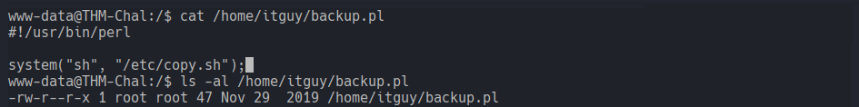

BUT the script used another file, `copy.sh`. If I could modify that and create a root backdoor, I would gain root access. 

Checked the content and the permissions for `copy.sh` as well:

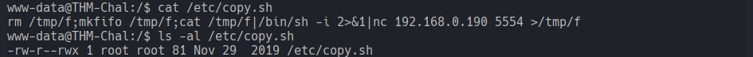

Aaaand BINGPOT! The permission were `rwx` for `others`.

This meant I could overwrite the file creating a local backdoor, and, since the `backup.pl` was run as sudo, the shell could be set as sudo too.

I proceeded by overwriting `copy.sh`:
```bash
echo "cp /bin/bash /tmp/rootbash; chmod +s /tmp/rootbash" > /etc/copy.sh
```
...and checked the content to double check the process worked:

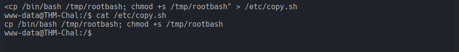

> Note to Self:  
> `chmod +s` sets the SUID (Set User ID) bit on the new file, which tells the OS to execute that program with the userid of its owner. Since this command is being run by root (via the Perl script), the owner of rootbash becomes root. 

Everything was set up, I took following steps:
- ran the `backup.pl` as sudo
- double-checked if the rootbash file was created
- checked the permits

`s` bit added successfully!

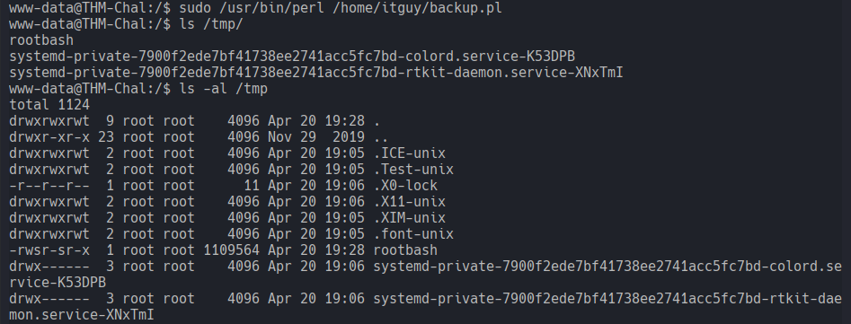

I fired `/tmp/rootbash -p` (-p to maintain SUID permit) and my prompt changed to `#`. Just as habit, I checked my identity, and, as last, I listed the content of `/root/` and found the root flag!

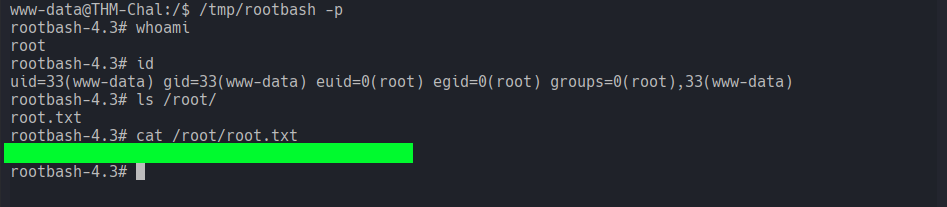

## After-Action Report: ??
I feel like the THM *Easy* category needs some subcategories! 


[<-- Home](/README.md)