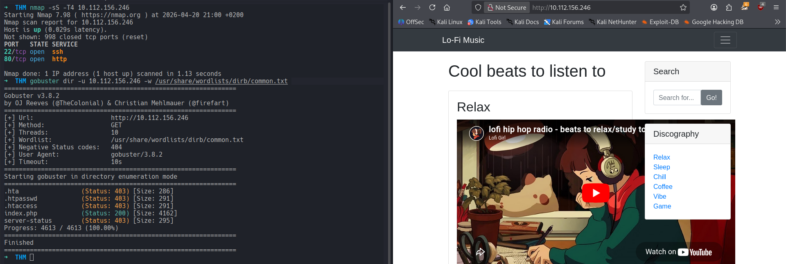
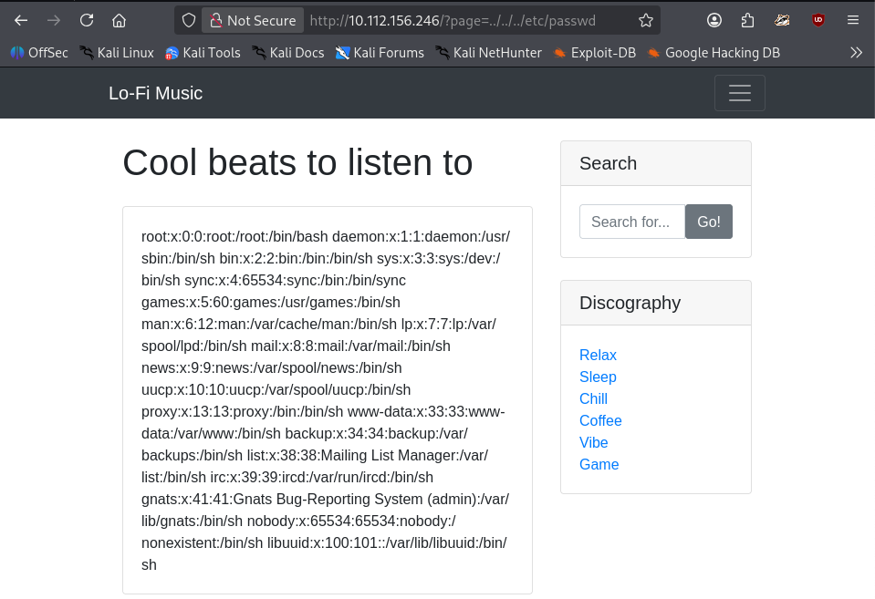
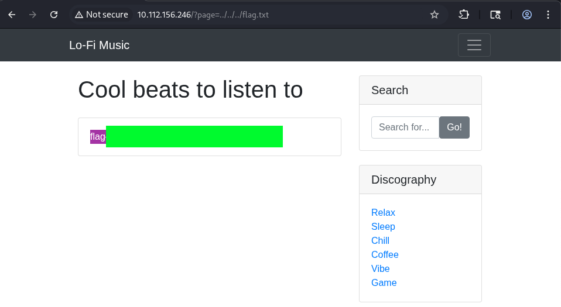

# Lo-Fi
### Want to hear some lo-fi beats, to relax or study to? We've got you covered!
#### Level: Easy

## Task 1: Lo-Fi
### Climb the filesystem to find the flag!
The task of this room mentioned LFI Path Traversal and File Inclusion, but I did a quick nmap and gobuster recon anyway, it's becoming a habit:

This gave no interesting results (as the room is intended for other purposes lol).  
While visiting the different Lo-Fi Categories, I looked at the URL and noted the URL Parameter `?page=relax.php`.  
I then tested and identified a LFI vulnerability with a directory traversal query `../../../`.  
By using this, I was able to break out of the web root and read the sensitive file `/etc/passwd`:

After this confirmation, I started thinking about the flag location. From `/etc/passwd` I could evince that there was not a possible *human* user, therefore I tried *including* blind a potential flag from the root filesystem `/`, and ultimately retrieved it:

[<-- Home](/README.md)