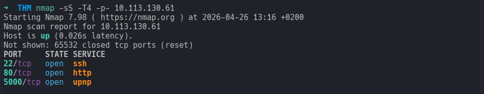
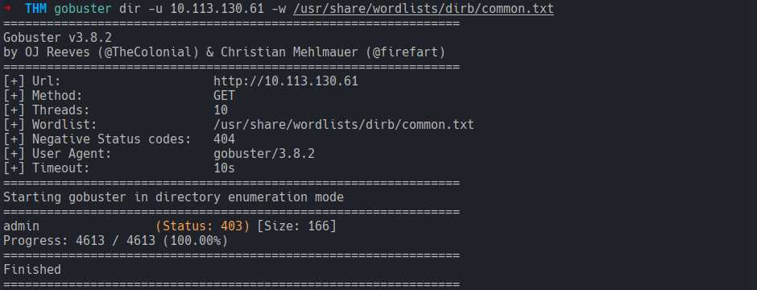
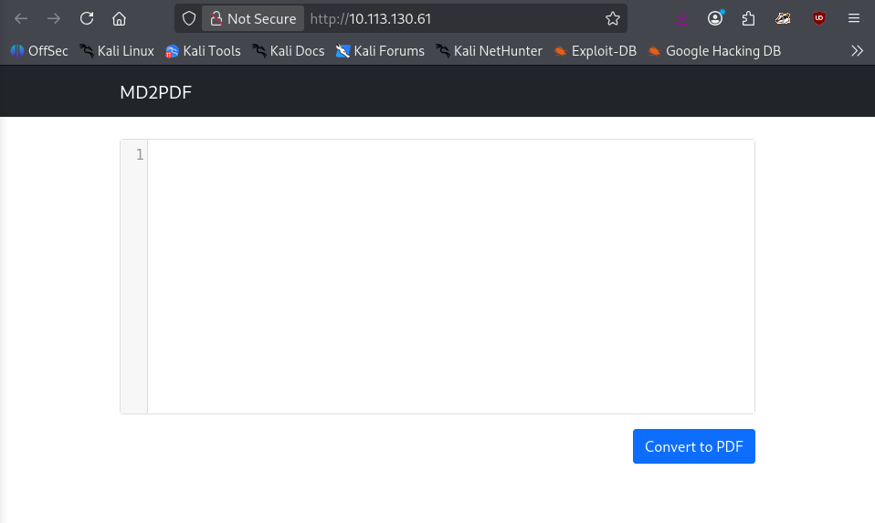
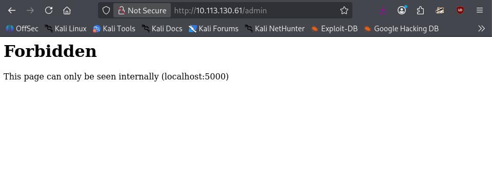
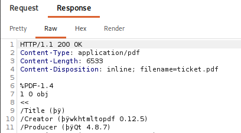
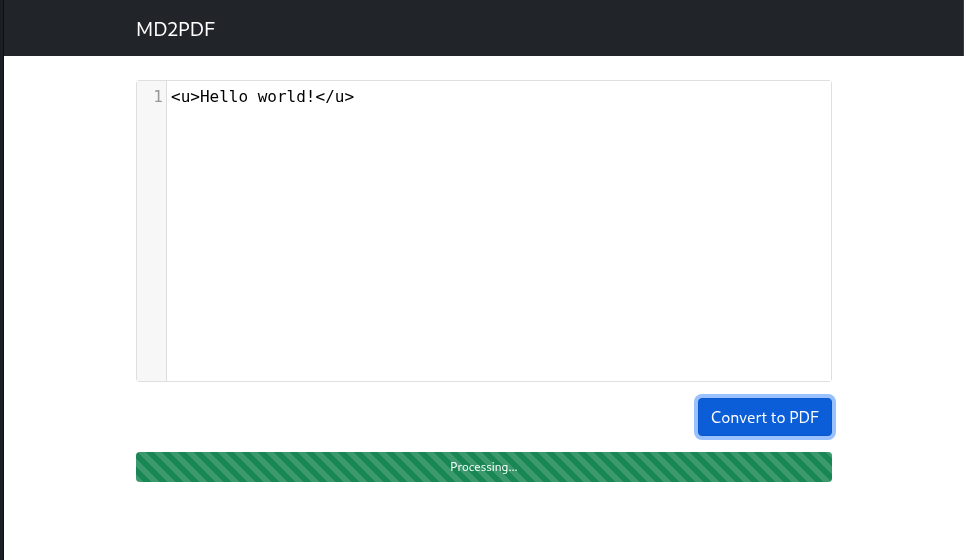
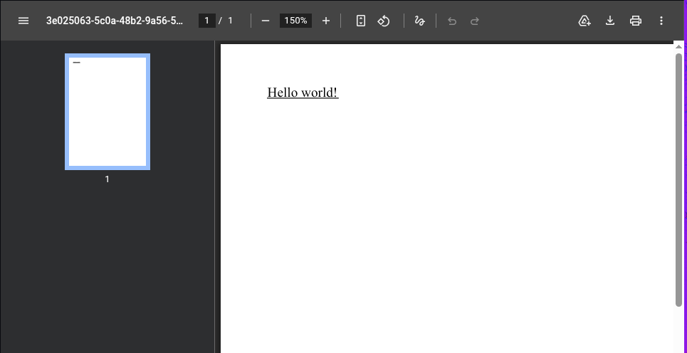
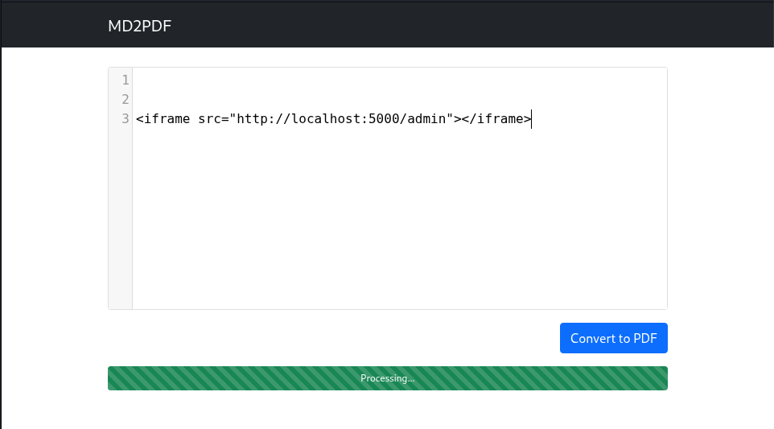
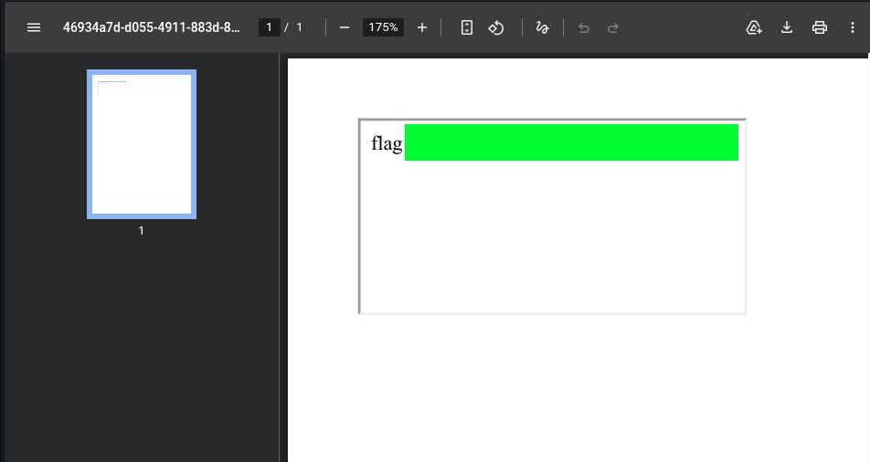

# MD2PDF
### TopTierConversions LTD is proud to present its latest product launch.
#### Level: Easy

## Task 1:
Hello Hacker!

TopTierConversions LTD is proud to announce its latest and greatest product launch: MD2PDF.

This easy-to-use utility converts markdown files to PDF and is totally secure! Right...?

### What is the flag?
This room was a frustration rollercoaster. It took me waaay more time than intended. But I realized I should keep my head cool.

Anyway, I started as always with a quick nmap scan:



And Gobuster directory discovery:



After that, I checked the web application hosted, which was, like described in the task, a `.md` to `.pdf` converter.



I also checked the `/admin` path, previously discovered, but it showed *Forbidden Access* to the admin panel, only accessible internally from `localhost:5000`.



At this point, I initially thought I could use Markdown file links, to include the flag. I gave a couple of tries like:
```
[test](flag.txt)
[test](./flag.txt)


```
But these returned broken links. The application was probably not built to include files using MD syntax. It was worth a try!

I brainstormed and opened Burpsuite to (try to) gather more info. After some requests, I confirmed the conversion endpoint to be `/convert`, and from one response I discovered the application used for the conversion, `wkhtmltopdf`:



This tool converts HTML into PDFs, which strongly hinted at injections (if vulnerable). 

> Note to Self:  
> In similar cases, always check the metadata with `exiftool` first!  
> I could have probably gathered this information much faster by checking the metadata of a saved pdf file, sparing Burpsuite :facepalm:

Anyway, I tested for HTML injections by submitting raw tags:



...which it worked by rendering the tags, confirming the backend was vulnerable to injections:



The only clue I had was the `/admin` page. It was forbidden to me as an external user, and only accessible internally from `localhost:5000`.  

#### The *SSRF* Attack (Server-Side Request Forgery)
Since the `wkhtmltopdf` converter was vulnerable, I tried leveraging it to make a request from *inside*. I used an `iframe` injection to trigger a *localhost* request, essentially tricking the server, allowing access to the internal admin panel:
```
<iframe src="http://localhost:5000/admin"></iframe>
```


The rendered pdf finally bypassed the restriction and showed the flag! 



What a frustrating but, in the end, satisfactory room!


[<-- Home](/README.md)