# Mr Robot CTF
### Based on the Mr. Robot show, can you root this box?
#### Level: Medium

## Hack the machine
Can you root this Mr. Robot styled machine? This is a virtual machine meant for beginners/intermediate users. There are 3 hidden keys located on the machine, can you find them?

### What is key 1?
I started by probing the server with a simple nmap scan. It showed me the ports 22, 80, 443 as closed and the rest as unfiltered (maybe a firewall?).
I decided to probe further with an **aggressive** scan, which showed the same ports as open. I guess the scripts of the aggressive scan completed the handshake and therefore the packets were not dropped?(wild guess).

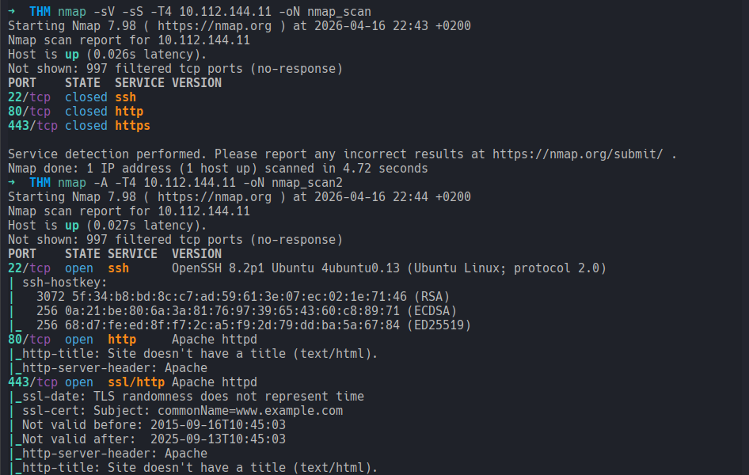

> Note to Self: The closed ports appearing open during an aggressive scan likely happened because -A includes scripts. Sometimes a simple SYN scan gets dropped by a firewall, but scripts trigger a response that confirms the port is actually listening.

Since the gobuster brute-forcing was still going on, I checked the website.  
I gotta say, the design was really well curated, from the login sequence at the begin, to the pseudo terminal and the other sections.  
A really good job, I felt immerse.

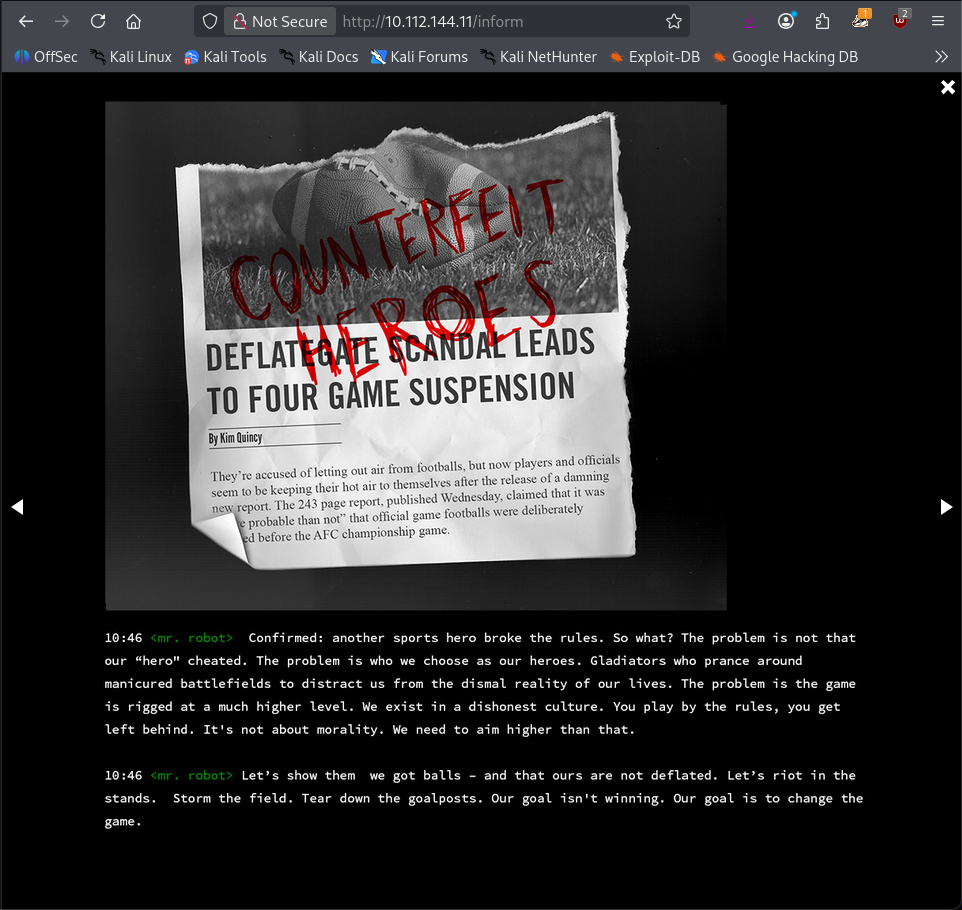

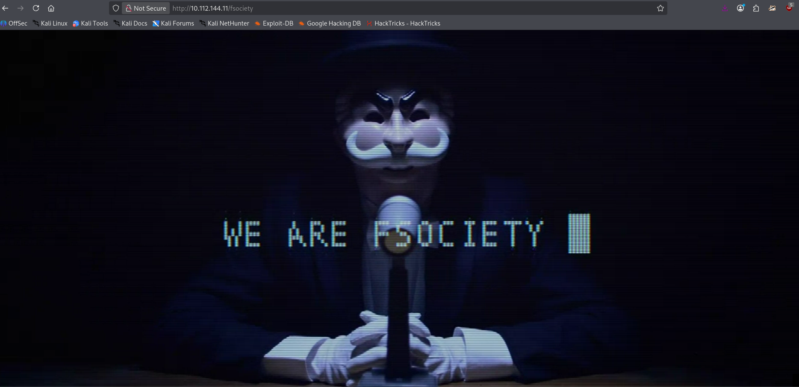

Once I was finished, I checked for `robots.txt` and found two hints, a path to a huge wordlist and a path to the first flag:

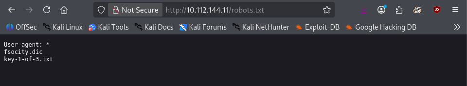

I downloaded the wordlist and visited the other path to obtain the first flag.

### What is key 2?
In the meantime, the gobuster scan was finished. Time to check it:

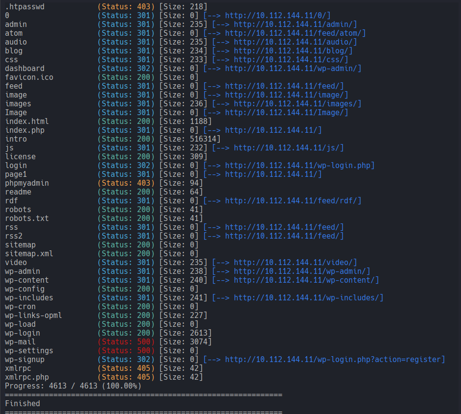

In the results there were several entries with the prefix `wp`, so I evinced that the website was a WordPress blog.  
Going on, there were a few code 200, so I started checking them one after the other:
- `/license` was the juiciest, since it had a clue for moving forward:

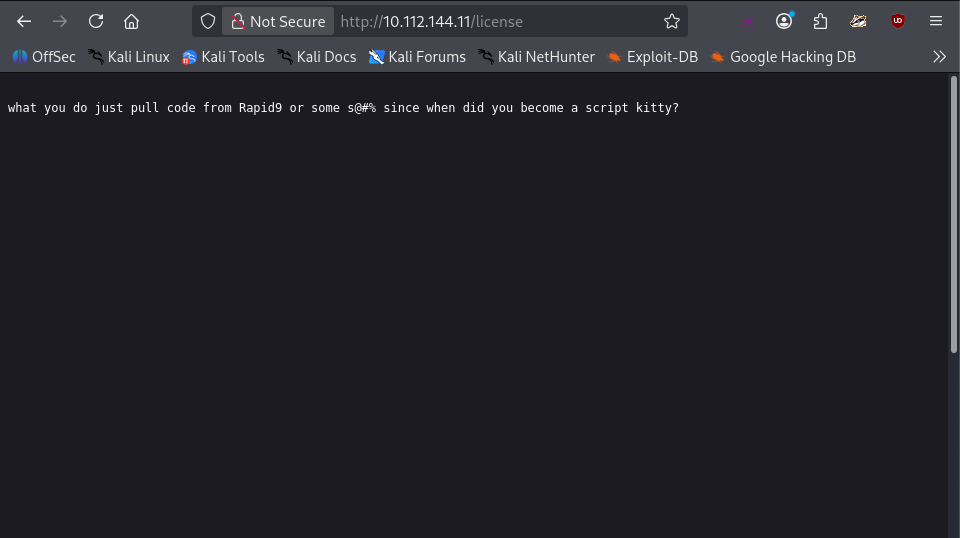

After scrolling down there was an encoded string:

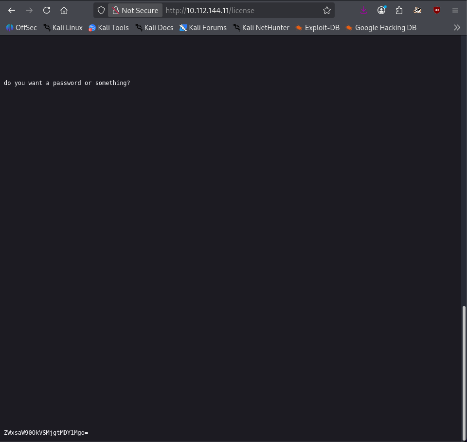

Seeing the padding at the end, my first try was decoding it from `base64`:

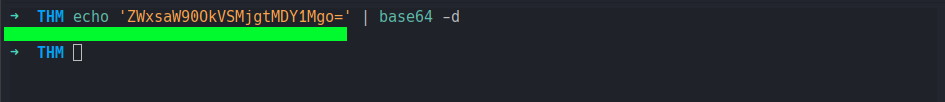

Credentials added to notes!

> [!NOTE]  
> Finding those credentials via the `/license` file is one path. However an alternative way, using the fsocity.dic wordlist for a brute-force attack, is documented in a [Digression Section](#what-about-the-wordlist-fsocitydic) at the end of this journal.

The rest of code 200s revealed nothing more:

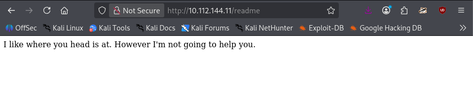
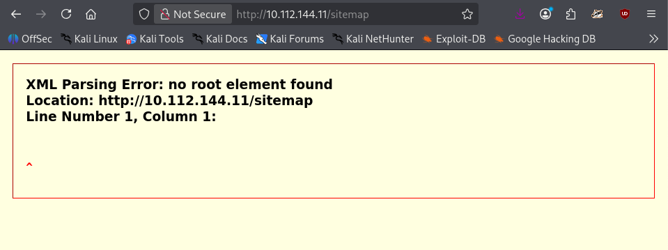

The next step was the WordPress login page:  
Since not restricted, I used the credentials previously decoded, logging in as Elliot!

Upon checking the Dashboard and the other WP sections, I found no clues to go on. One funny thing I found though, while checking users, was the account of the MR Robot therapist, Krista Gordon. This was a dead end too, moreover the biographical info was mocking me lol:

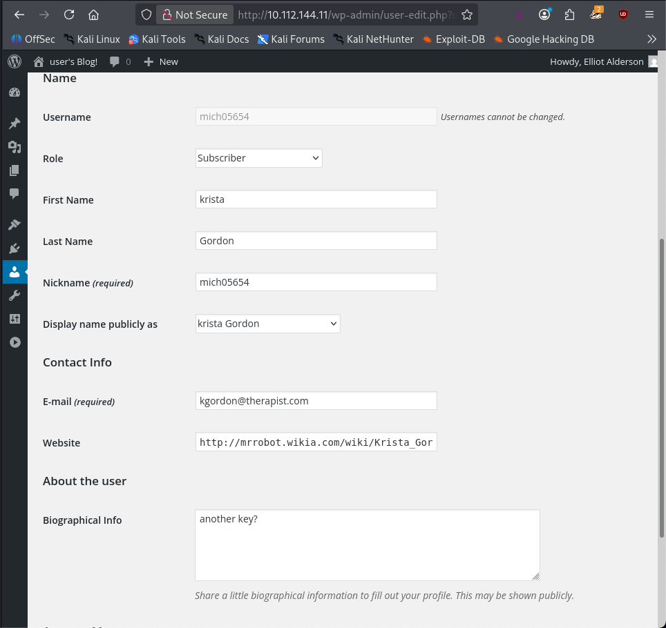

At this point I checked the Wordpress version and searched for vulnerability, which there were plenty.
While checking them I stumbled on this one:

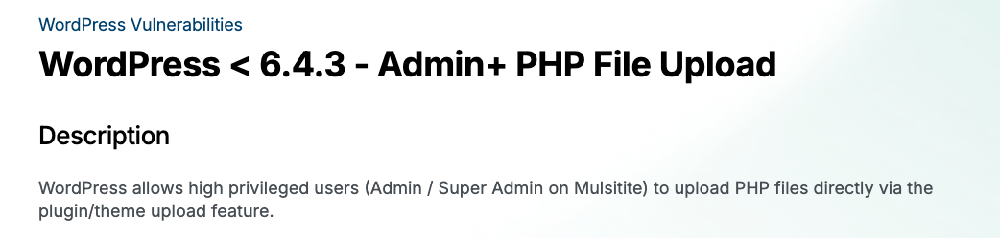

...aaand it hit me!

> A *Brain finally braining* moment:  
> This reminded me of the **RootMe** Room. If I could plant a php reverse shell on a page somewhere in the blog, I could then connect and intrude into the server!

As administrator of the blog, I found out I could do this into the Theme/Templates.

I went to Themes/Plugin Editor, found the templates page, picked the `author-bio.php` and pasted the Php reverse shell in it (same used in other rooms found in kali at `/usr/share/webshells/php/php-reverse-shell.php`), with my IP and listener port adjusted.

In my terminal, I then started a netcat listener and, afterwards, I navigated to the `author-bio.php` template under `http://10.112.144.11/wp-content/themes/twentyfifteen/author-bio.php`, and the connection was successfully established:

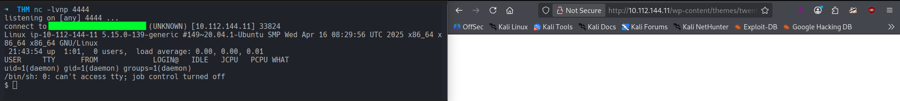

The next step I took was to `fix` the shell:
- checked if python was installed
- spawned a python pty pseudo terminal: 
```bash
python -c 'import pty; pty.spawn("/bin/bash")'
```
- fixed the local shell command interception:
```bash
# Ctrl + Z and then
stty raw -echo; fg
export TERM=xterm
```

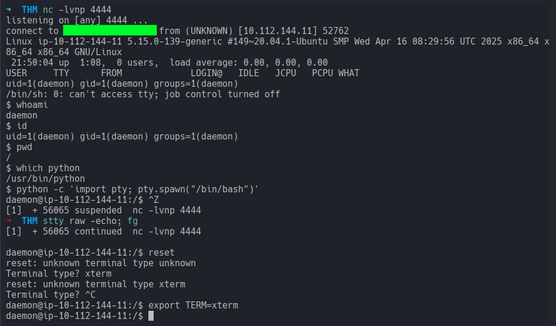

In the search for the second flag, I looked into `/home` and found `robot` and `ubuntu`.  
In the former, I found `key-2-of-3.txt` but I got a permission denied while opening it.  
I checked for permissions and indeed only the user `robot` could interact with it.  
On the other hand I could access `password.raw-md5`, which showed a password hash:  

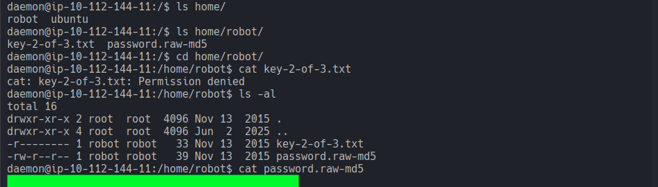

I copied the hash in a file `hash.txt`, and used `john` to try to crack it:

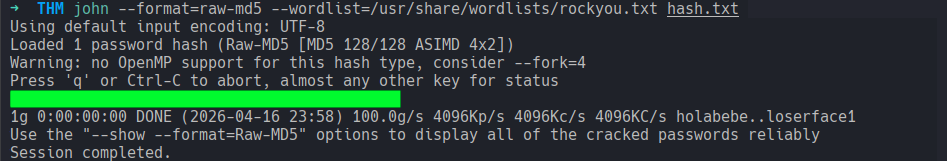

The cracking worked!  

I copied the password and logged in successfully as `robot`.  
First I confirmed my identity and then checked for sudo list. Unfortunately `robot` couldn't run sudo:

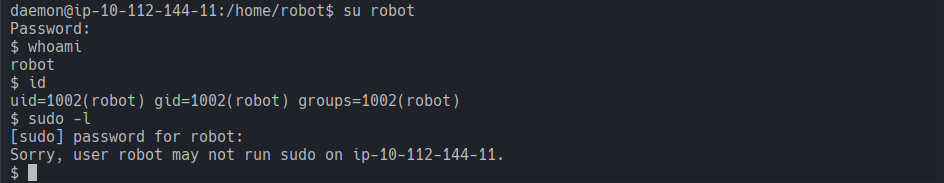

But, before attempting privilege escalation, I spawned again a `python pty` (robot shell looked weird) and obtained flag nr. 2:

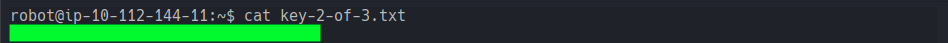

### What is key 3?
`sudo -l` gave me no results, therefore I ran:
```bash
find / -user root -perm /4000 -type f 2>/dev/null
```
to search for SUID files:

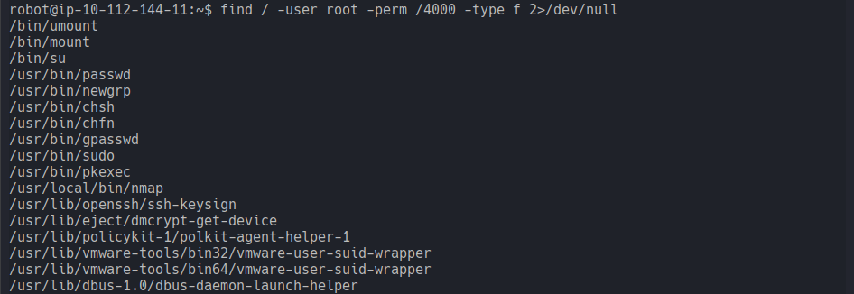

It found different binaries. I checked **GTFOBins** and `nmap` seemed to be the quickest and easiest escalation:

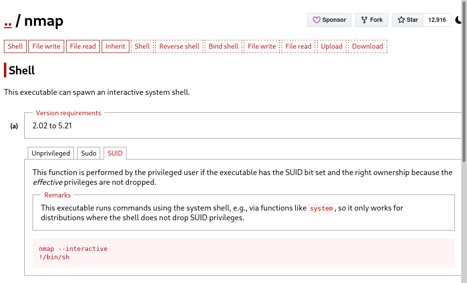

I followed the instructions, ran `nmap` in interactive mode but got some problems with the second command:
- `!/bin/sh` or `!/bin/bash` didn't work

I thought for a couple of seconds and made a try removing `/bin/`:
- `!bash` did work and it escalated me to root!

From there I double-checked my id and listed the content of `/root/`, finding the last flag:

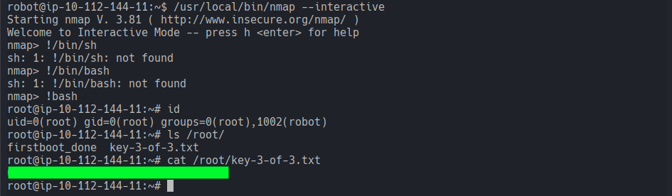

...and closing this room!

What a humbling but funny and well curated room!     


## After-Action: What about the wordlist `fsocity.dic`?
I didn't forgot about this, but since the other clues brought me to the end, I didn't change path of actions.  
I briefly interacted with it though:  
While scrolling in it, I noticed that a really long entry repeated itself more than once:

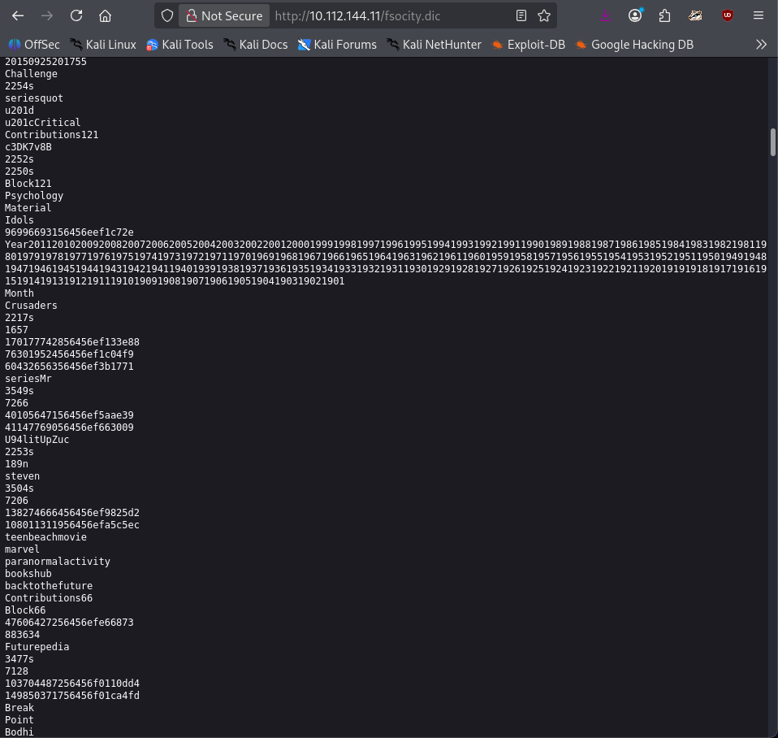

so I applied *Wordlist De-duplication* to sort it and remove duplicates:
```bash
sort -u fsocity.dic > fsocity_sort_uniq.dic
```
This shrank the wordlist quite a lot in entries and dimensions, reducing future redundant requests and enhancing efficiency:  

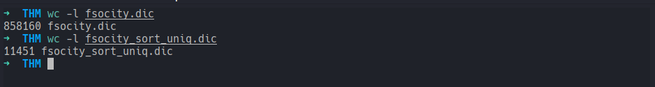

After this brief interaction though, I didn't touch it again.

Well, until now.  
I have the habit of checking other's people write-up to see if a task can be tackled in a different way, and therefore learn more.  
And here is what I found about the use of the `fsocity.dic`.  
Summarized, the WordPress Login page is really *chatty* in the errors, giving away too much information about wrong password or wrong username. This could be abused using the `fsocity.dic` wordlist and `hydra`, for finding out, in two runs, the right username and password.

This looked looked fun and interesting, so I wanted to try it!

### Testing 
While testing wrong credentials, the WordPress login page showed the error `Invalid username`, which is super useful for the negative logic brute-forcing of `hydra`.

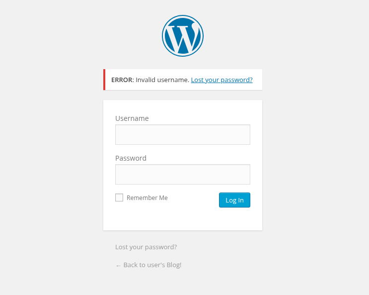

With Burpsuite Proxy open, I attempted a failed login for analyzing and retrieving the POST request content, from the HTTP History section.

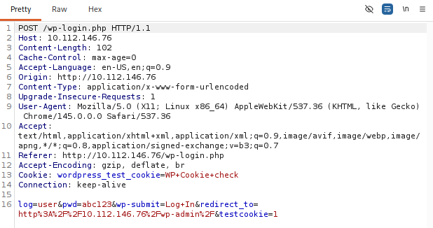

For the next step, I copied the  request content:  
`log=user&pwd=abc123&wp-submit=Log+In&redirect_to=http%3A%2F%2F10.112.146.76%2Fwp-admin%2F&testcookie=1`  

And crafted the hydra command for brute forcing the login and discover the right user:   
```bash
hydra -L fsocity_sort_uniq.dic -p test 10.112.146.76 http-post-form "/wp-login.php:log=^USER^&pwd=^PWD^&wp-submit=Log+In&redirect_to=http%3A%2F%2F10.112.146.76%2Fwp-admin%2F&testcookie=1:Invalid username" -t 64
```
The parameters between `^ ^` are hydra placeholders, the line after the `:` is the Failure condition. This command uses a negative logic, it makes attempts until, hopefully, the Failure condition is not met, ergo a possible valid credential is found.  

At process completed, hydra found three candidates, same username but different cases. Probably in the database of this wordpress version, the username is *case-insensitive*.

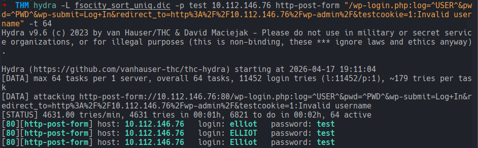

Now the same logic would also apply for finding out the password, or at least I thought.  
Proceeding, I crafted a similar command, changing following:
- the user flag from `-L` to `-l` with the new found username
- the password flag from `-p` to `-P` followed by the wordlist
- the failure data with a portion of the new error, triggered inserting right user but wrong password:  
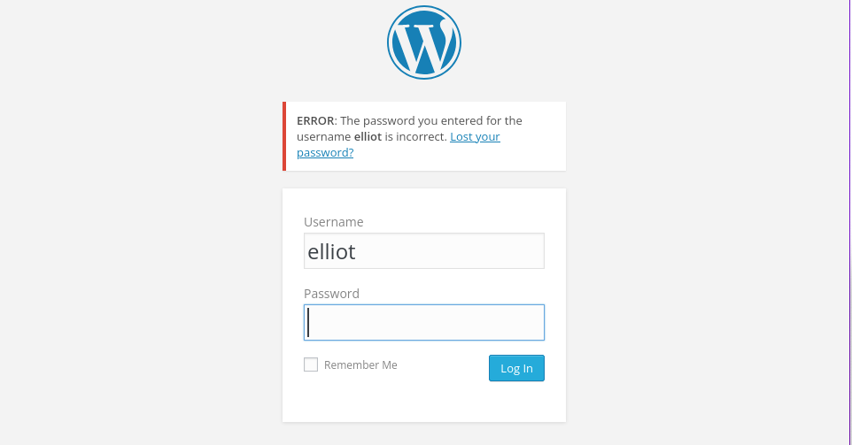

The line would be:
```bash
hydra -l elliot -P fsocity_sort_uniq.dic 10.112.146.76 http-post-form "/wp-login.php:log=^USER^&pwd=^PWD^&wp-submit=Log+In&redirect_to=http%3A%2F%2F10.112.146.76%2Fwp-admin%2F&testcookie=1:The password you entered for" -t 64
```
BUT this didn't report any results at all:

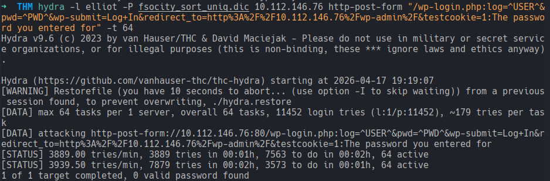

I tried narrowing down the negative logic changing the failure data several times, but still nothing.  
Out of ideas, since for this step hydra seemed a dead end, I searched for a different option and found a tool called `wpscan`.  
I tried it right away firing:
```bash
wpscan --url http://10.112.146.76 --usernames elliot --passwords fsocity_sort_uniq.dic
```

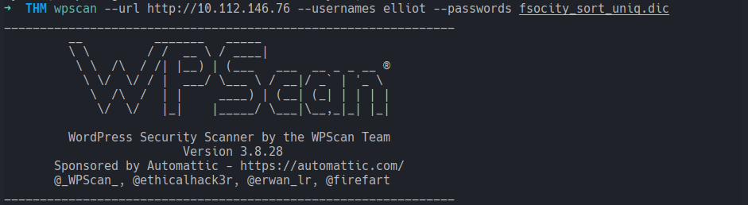

...which worked successfully finding the right password:

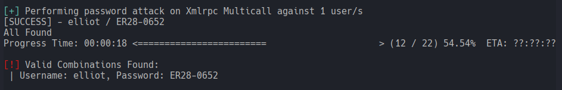

Aaaand here ends the little digress about using the wordlist `fsocity.dic`.  
It thought me other ways to use hydra, made me mad about the flaws (probably in my knowledge) of not finding the password, BUT I discovered a new tool, `wpscan`.

Following this, the process for clearing the room stays the same.


[<-- Home](/README.md)