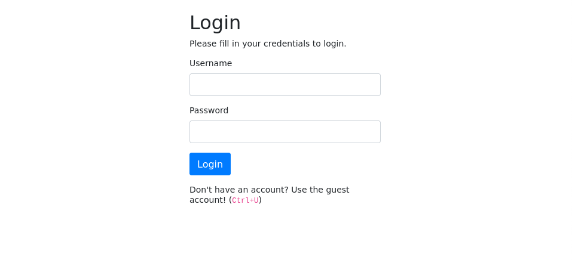
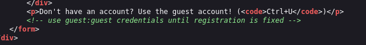
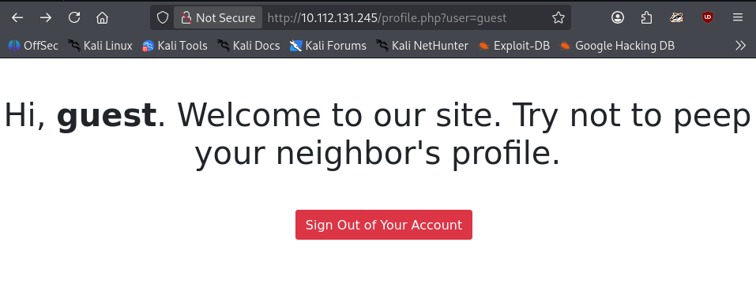
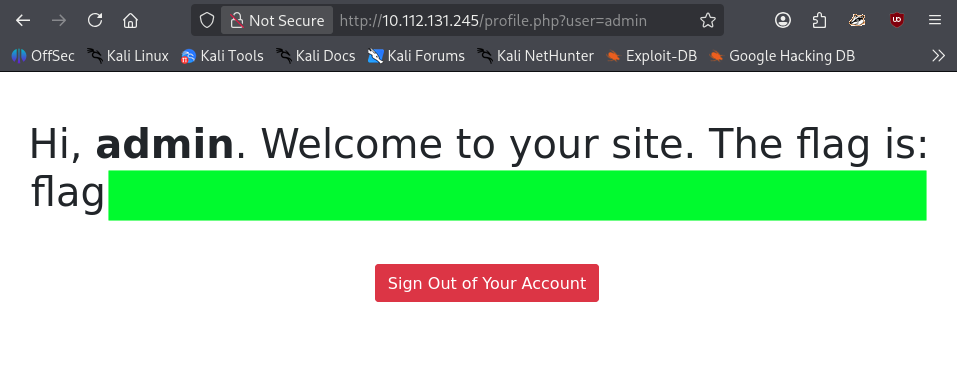

# Neighbour
### Check out our new cloud service, Authentication Anywhere. Can you find other user's secrets?
#### Level: Easy
Check out our new cloud service, Authentication Anywhere -- log in from anywhere you would like! Users can enter their username and password, for a totally secure login process! You definitely wouldn't be able to find any secrets that other people have in their profile, right?

## Reconnaissance: Nmap and Gobuster
I began by performing a quick Nmap scan and directory brute-forcing with Gobuster simultaneously:
```bash
➜  ~ nmap 10.112.131.245 -Pn -T4                                                                       
Starting Nmap 7.98 ( https://nmap.org ) at 2026-04-09 16:22 +0200                                      
Nmap scan report for 10.112.131.245                                                                    
Host is up (0.029s latency).                                                                           
Not shown: 998 closed tcp ports (reset)                                                                
PORT   STATE SERVICE                                                                                   
22/tcp open  ssh                                                                                       
80/tcp open  http           
```

Gobuster revealed standard PHP files:
```bash
➜  ~ gobuster dir -u 10.112.131.245 -x php,html,txt,pdf -w /usr/share/wordlists/dirb/common.txt        
#...                   
db                   (Status: 301) [Size: 313] [--> http://10.112.131.245/db/]                         
db.php               (Status: 200) [Size: 0]                                                           
index.php            (Status: 200) [Size: 1357]                                                        
index.php            (Status: 200) [Size: 1357]                                                        
login.php            (Status: 200) [Size: 1316]                                                        
logout.php           (Status: 302) [Size: 0] [--> login.php]                                           
profile.php          (Status: 302) [Size: 0] [--> login.php]                                           
server-status        (Status: 403) [Size: 279]                                                         
Progress: 23065 / 23065 (100.00%)                                                                      
===============================================================                                        
Finished                                                                                               
===============================================================  
```

## Website Inspection
While the Gobuster brute-forcing was almost done, I already found the flag.
I visited the login page and checked the HTML source code (as hinted), which conveniently provided guest credentials: `guest:guest`.





Upon logging in, I was redirected to `http://10.112.131.245/profile.php?user=guest`.
This showed a classic *Direct Object Reference*, to which I wondered if secure or insecure - IDOR.



## Exploitation: IDOR and flag
Upon changing the parameter in the URL to `user=admin`, the admin page was rendered, the *Profile* header changed to `admin` and the flag was revealed. This confirmed that the server was fetching data based solely on the URL string rather than my active session.




[<-- Home](/README.md)