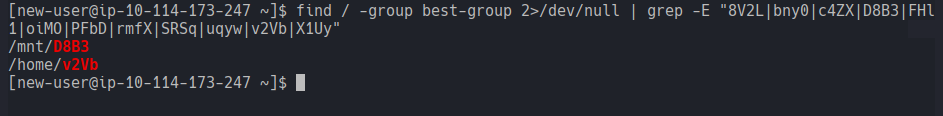
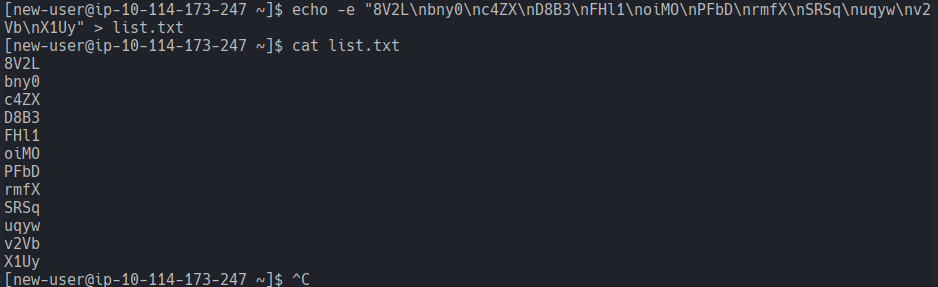
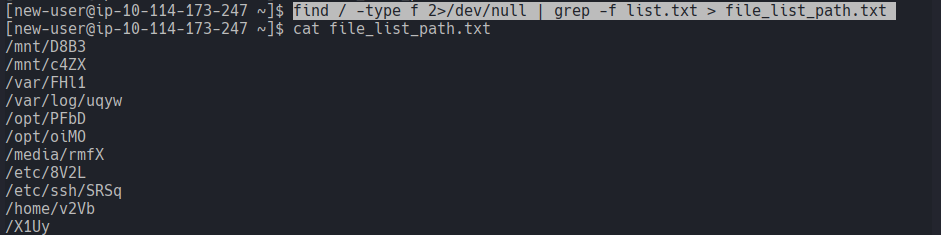
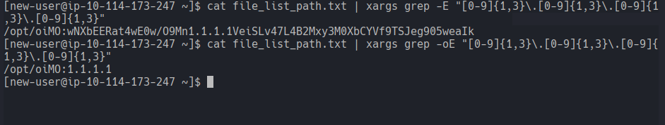
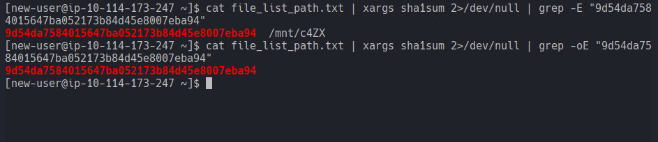
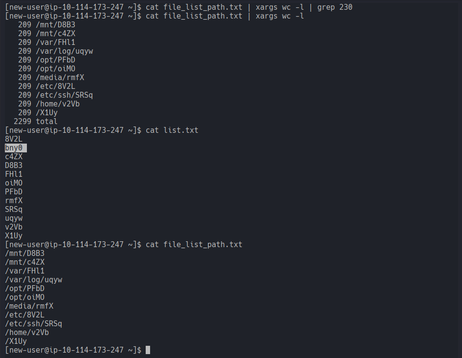
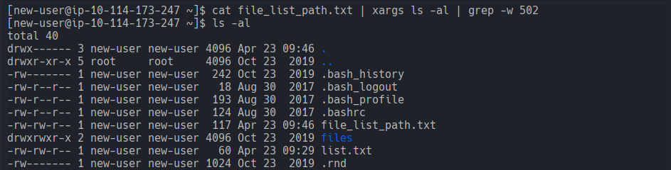
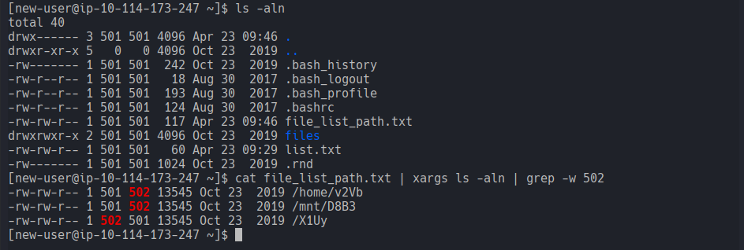
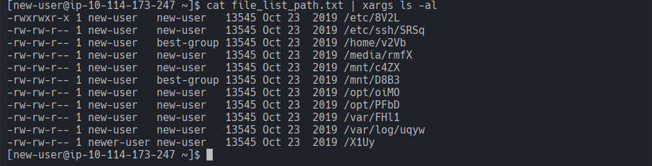
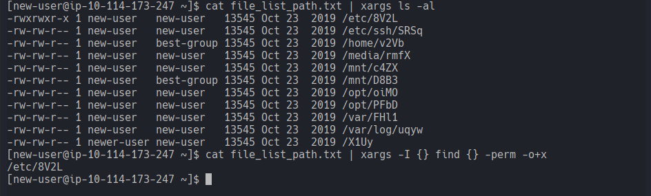

# Ninja Skills
### Practise your Linux skills and complete the challenges.
#### Level: Easy

## Task 1: Ninja Skills
Answer the questions about the following files:
- 8V2L
- bny0
- c4ZX
- D8B3
- FHl1
- oiMO
- PFbD
- rmfX
- SRSq
- uqyw
- v2Vb
- X1Uy

The aim is to answer the questions as efficiently as possible.

### Which of the above files are owned by the best-group group(enter the answer separated by spaces in alphabetical order)
The tool for the job is definetely `find`. To answer the first question I ran:


- `grep -E`: The `-E` flag enables extended regex, so symbols like the pipe doesn't need to be escaped with a backslash.

As mentioned in the room, the aim is to be *efficient*. For avoiding searching the whole file system in every search, I passed the name of the files in a `list.txt`:


- `echo -e`: The `-e` enables special characters, the `\n` is interpreted as new line.

And then used that file for a search, in order to create a new `file_list_path.txt` containing the file paths, to facilitate future searches.



### Which of these files contain an IP address?
My thoughts were to use a regex pattern, so searched for it and applied it. The command worked but the output included the whole line.  
So I narrowed the search adjusting the grep flag to `-o` to only match the pattern. Unnecessary step but the output looked cleaner:




### Which file has the SHA1 hash of 9d54da7584015647ba052173b84d45e8007eba94
For this question I used a similar approach to the previous:



> Note to Self:  
> The use the grep flag `-o` in this task wouldn't be quite right, because grep is grepping the standard output of `sha1sum`, which is a formatted string that looks like \<hash> \<path>. Including `-o` would only show the hash.  
> A Different case is the previous question, in which grep was opening and reading the contents of the files. And the output of grep in that case looks like \<filename>:\<entire line of text>.

### Which file contains 230 lines?
This one was a little tricky. Not in the execution but in answering the question. I was like *you got me!* lol  
I started right away following the same idea using `wc -l` for counting the lines.
I ran it but I got no results. I double checked it removing the grep part and I saw no file having 230 lines. I counted 11 entries, which was odd because the file list had 12 in it. I further double checked `list.txt` and `file_list_path.txt`, created at the beginning of the room, and confirmed that the initial list had 12 elements but the paths in the second list were 11. So the missing one was probably the answer:



### Which file's owner has an ID of 502?
I felt on a roll, so I fired securely following command, but it didn't work:



Aaand then I remembered, depending on the system configuration, the user ID can be represented with their respective username. I modified the `ls` comannd adding the `-n` flag for showing the numeric UID.



### Which file is executable by everyone?
For this I just looked at the output of `ls` and spotted the `x` permit for everyone:



This completed the room! :D

At the same time though, I wondered what would be the best way to automate this last task, if the file list would be extremely long?  Watching the `ls` output wouldn't be that efficient.  
I searched for an efficient way and this would be using `xargs` with a placeholder {} to ensure that `find` receives each path as a specific argument, kinda like a for loop. 

The command would be 
```bash
cat file_list_path.txt | xargs -I {} find {} -perm -o+x
```

- `xargs -I {}`: Takes each line from the file and plugs it into the {} placeholder in the next command.
- `find {}`: The `find` command then *taps* into the (kinda) list `{}` and executes per placeholder. 
- `-perm -o+x`: The filter. It filters for the group `other` specifically that has at least an execute perm.



I tried to be as ninja as possible, Room down!


[<-- Home](/README.md)