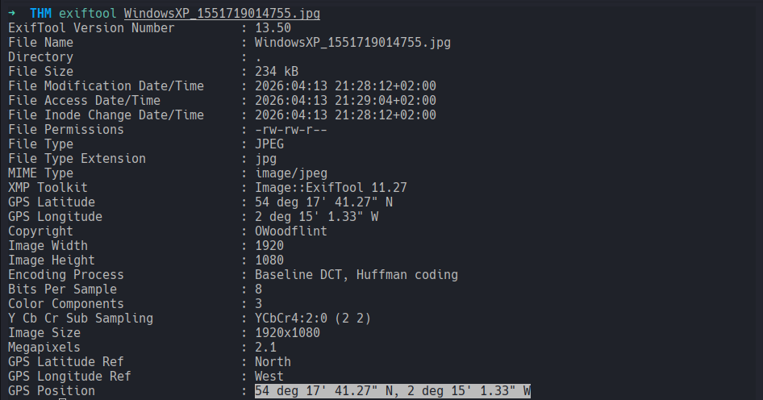
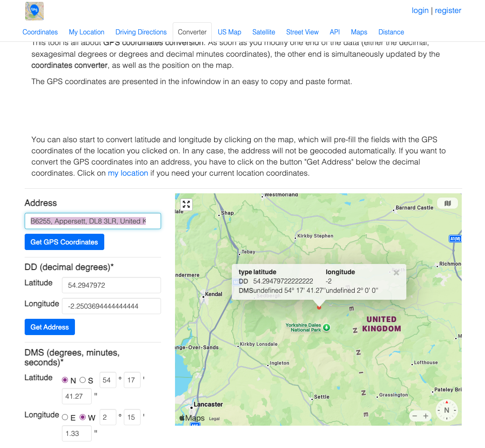
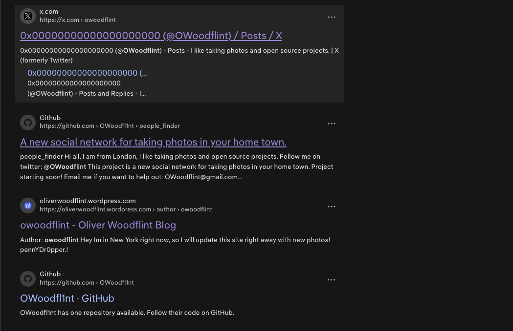
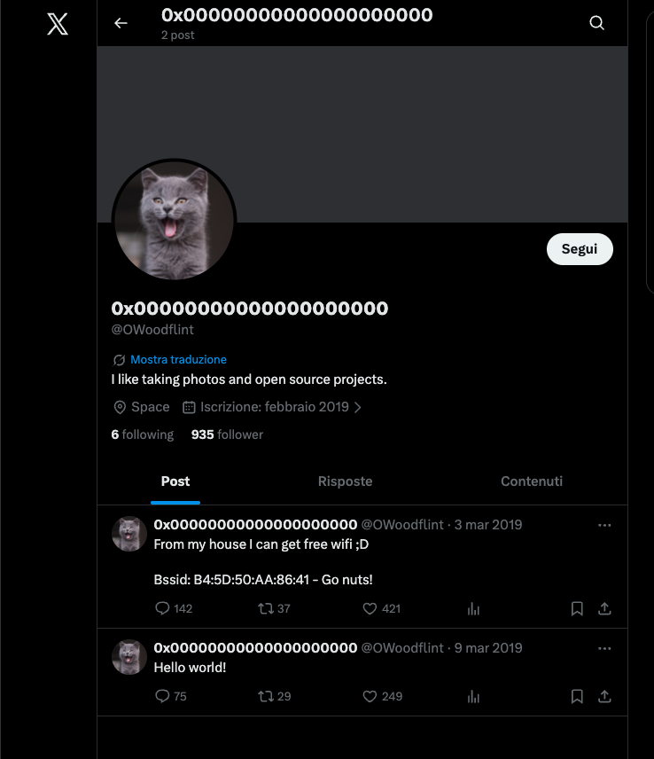
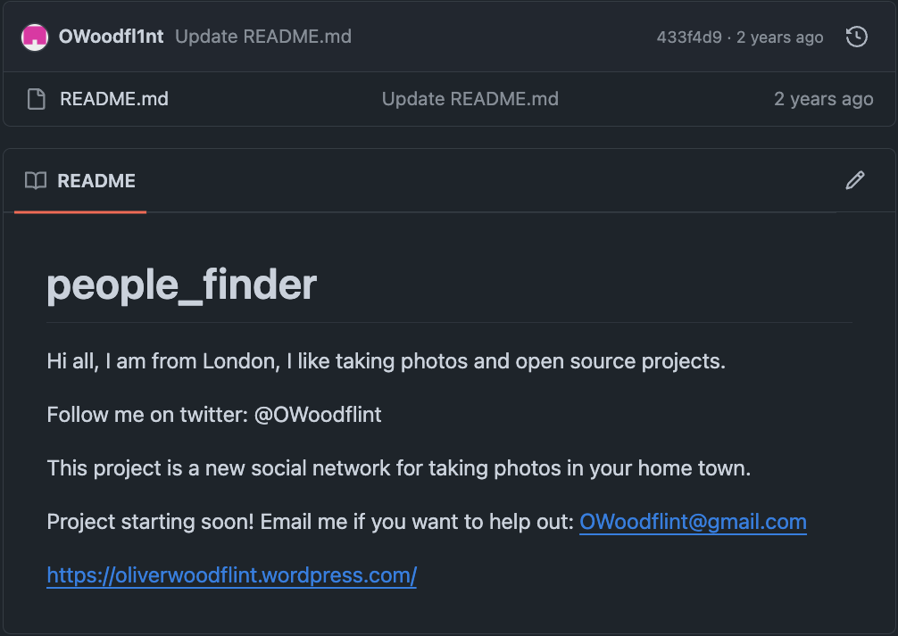
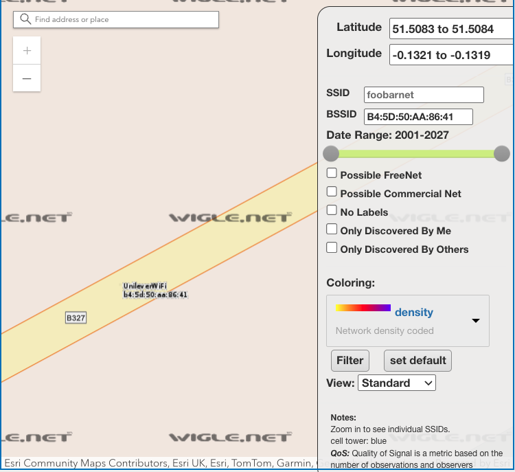

# OhSINT
### Are you able to use open source intelligence to solve this challenge?

#### Level: Easy

## Task 1: What information can you possibly get with just one image file?
### What is this user's avatar of?
For starters I downloaded the image and checked the metadata with Exiftool:

I noted down the copyright name and the GPS coordinates.  
Since the coordinates were in DMS format (`degrees, minutes, seconds`), I converted them to DD (`decimal degrees`) for better search.
- Latitude 54.2947972
- Longitude -2.2503694444444444

The converter I used was already one step ahead and gave me the Address:
- B6255, Appersett, DL8 3LR, United Kingdom

After checking the location in the street-view map, I realised that this was a dead end.

*Skip to the copyright*

I googled *Owoodflint* and found different results: `X`, `Github`, `Wordpress`.

Upon checking the `X` profile, I found the answer to question number one and a hint for later.

### What city is this person in?, What is his personal email address?, What site did you find his email address on?
The sole `people_finder` readme on the Github page, revealed answers to 3 of the Task question! 

### What is the SSID of the WAP he connected to?
For this, the clue resides in the previous `X` post:

To find out the name of the access point, I searched the BSSID on `https://wigle.net/`:

> (from Wikipedia) ... a website for collecting information about the different wireless hotspots around the world. Users can register on the website and upload hotspot data like GPS coordinates, SSID, MAC address and the encryption type used on the hotspots discovered

By filtering the BSSID, I got as result a wi-fi SSID in a London street.

## Where has he gone on holiday?, What is the person's password?
The last two answers are both on the Wordpress log:
- the holiday location is right in the homepage 
- the password is also there but hidden in plain sight

The password was there all along in the first search for Owoodflint...

... but visiting the wordpress homepage didn't showed it.
By highlighting the holiday entry though, the password is revealed (similar to a challenge in CTF Challenges vol 1).

And this fun osint challenge is down :)

[<-- Home](/README.md)