# RootMe
### A ctf for beginners, can you root me?
#### Level: Easy

## Task 1: Deploy the machine
Always the easiest!

## Task 2: Reconnaisance
### Scan the machine, how many ports are open?
### What version of Apache is running?
### What service is running on port 22?

I performed a quick nmap scan and with the results, the first three questions were answered:

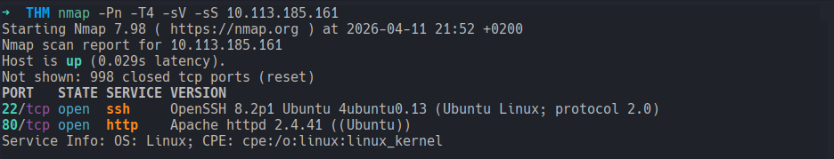

### What is the hidden directory? (Find directories on the web server using the GoBuster tool.)

After the nmap scan I brute forced the address with Gobuster and found the hidden directories:

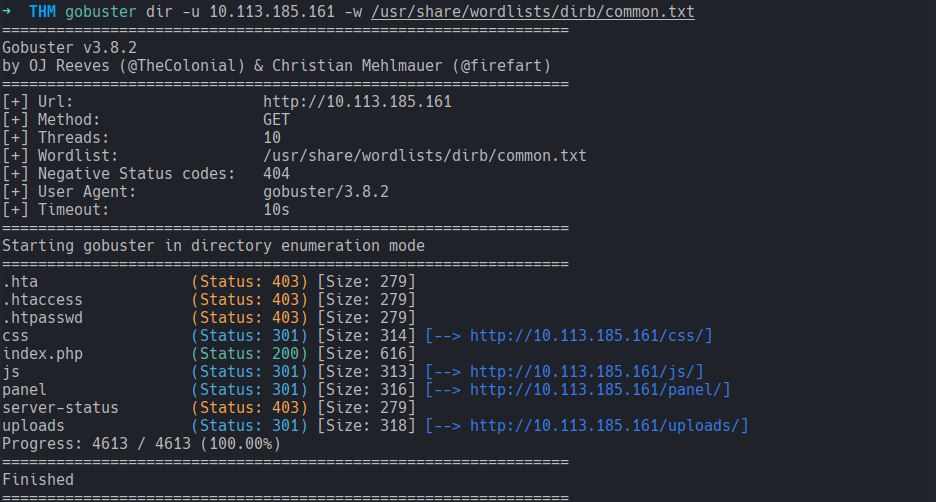

## Task 3: Getting a shell 
I tested the upload functions by uploading an `example.php` file:

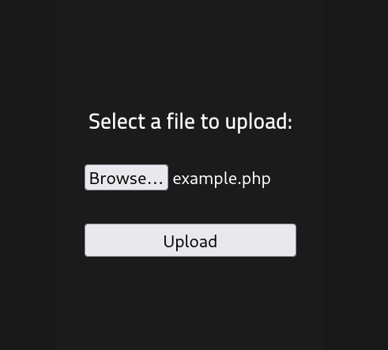

...which failed, showing that PHP uploads are filtered out.

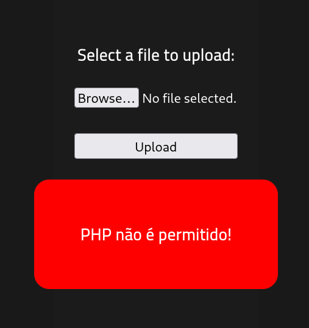

The move was then, trying to find a way around the filter. Uploading images worked.  
I then tried uploading an `example.php3`:

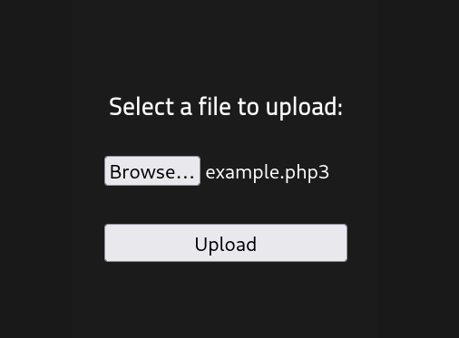

Which surprisingly worked:

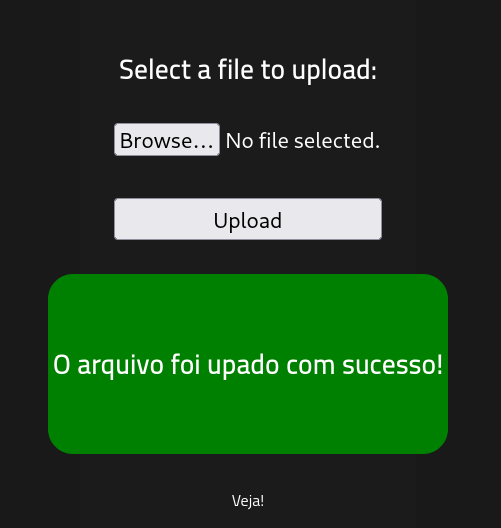

Since `.php3` was not filtered out, I copied a kali pre-loaded php shell from `/usr/share/webshells/php/php-reverse-shell.php` to my current directory, added my IP address and a netcat listener port, and uploaded it to the website.

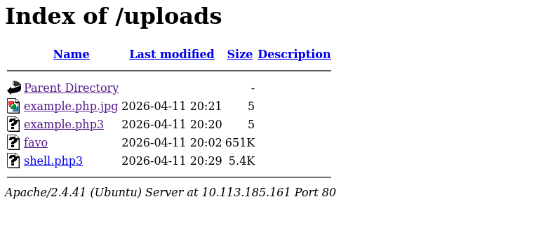

Afterwards I took following steps:
- set a netcat listener: `nc -lvnp 4444`
- clicked on the fresh uploaded `shell.php3` in the upload section  

...aaand no results, no connection to the listener.  
I wondered: the `shell.php3` was successfully uploaded but was it processed and executed? Definetely not.

I tried the same approach but, this time, saving the shell as a `.phtml` instead.
After navigating to `/uploads/` and selecting `shell.phtml`, netcat received a connection!

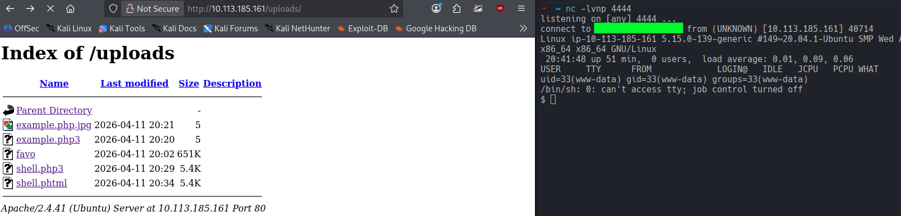

With the connection established, I used the same shell fix I used in the *Pickle Rick* room:
- checked if python3 was installed
- spawned a python pty pseudo terminal: `python3 -c 'import pty; pty.spawn("/bin/bash")'`
- fixed the local shell command interception: `stty raw -echo; fg` and `export TERM=xterm`

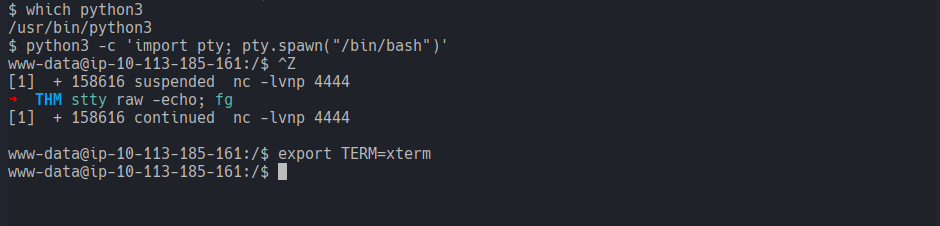

Finding the user flag was easy, since the THM Dashboard wrote the name under the Task 3: `user.txt`.  
Therefore, being already in the `/` directory, I launched a `find . -type f -name user.txt 2>/dev/null` command and bingpot!

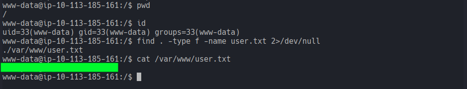

## Task 4: Privilege escalation
### Search for files with SUID permission, which file is weird?
For this escalation the THM questions were super helpful.

I sarched for files with root permissions with `find / -user root -perm /4000 -type f 2>/dev/null` and spotted `python2.7`!

In **GTFOBins** I found a useful command described under python/shell/SUID section:
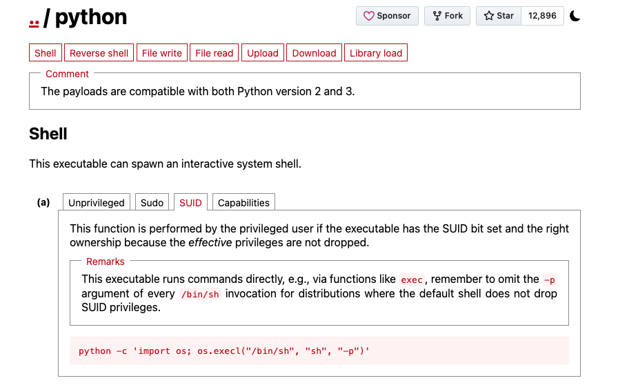

Quick look up for the command:
`python -c 'import os; os.execl("/bin/sh", "sh", "-p")'`
- `os.execl`: This replaces the current python process with a shell.
- `-p`: Tells the shell to preserve the effective user ID (which is root thanks to SUID)

I attempted then privilege escalation with this one liner and it worked, I successfully escalated to root!  
From there I changed directory to `/root/` and found the root flag :)
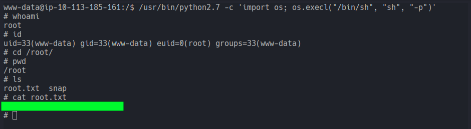

Another room down!

[<-- Home](/README.md)