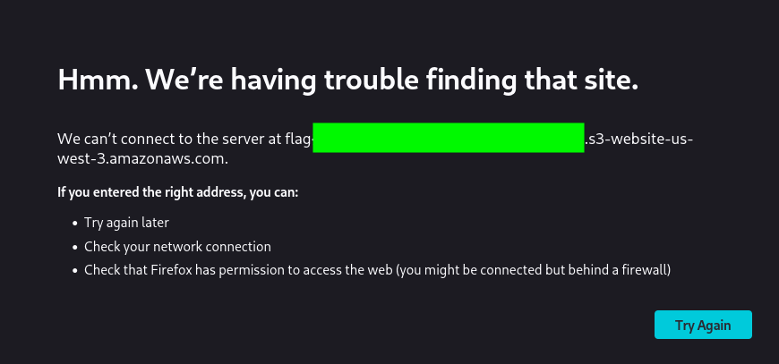

# TakeOver
### This challenge revolves around subdomain enumeration.
#### Level: Easy
Hello there,

I am the CEO and one of the co-founders of futurevera.thm. In Futurevera, we believe that the future is in space. We do a lot of space research and write blogs about it. We used to help students with space questions, but we are rebuilding our support.

Recently blackhat hackers approached us saying they could takeover and are asking us for a big ransom. Please help us to find what they can takeover.

Our website is located at https://futurevera.thm(opens in new tab)

Hint: Don't forget to add the MACHINE_IP in /etc/hosts for futurevera.thm ; )

## Quick Recon Nmap Scan
I began by adding the machine IP to my `/etc/hosts` file and running a standard Nmap scan, which revealed a standard web setup with both HTTP and HTTPS available:
```bash
nmap futurevera.thm -Pn -T4                                                               
Starting Nmap 7.98 ( https://nmap.org ) at 2026-04-08 18:27 +0200                              
Nmap scan report for futurevera.thm (10.114.135.61)                                            
Host is up (0.030s latency).                                                                   
Not shown: 997 closed tcp ports (reset)                                                        
PORT    STATE SERVICE                                                                          
22/tcp  open  ssh                                                                              
80/tcp  open  http                                                                             
443/tcp open  https                                                                            
```
## Enumeration: Gobuster and ffuf
1. Since the room is centered on **subdomain enumeration**, I initially attempted `gobuster` in dns mode. However, despite trying different wordlists, there were no results in sight.

2. I switched to `ffuf` and attempted again enumeration:
The first run was producing a massive amount of false positives:
```bash
➜  ~ ffuf -w /usr/share/wordlists/seclists/Discovery/DNS/subdomains-top1million-110000.txt -u https://10.114.135.61 -H "Host: FUZZ.futurevera.thm"                                                                
                                                                                                                                                                                                                  
        /'___\  /'___\           /'___\                                                                                                                                                                           
       /\ \__/ /\ \__/  __  __  /\ \__/                                                                                                                                                                           
       \ \ ,__\\ \ ,__\/\ \/\ \ \ \ ,__\                                                                                                                                                                          
        \ \ \_/ \ \ \_/\ \ \_\ \ \ \ \_/                                                                                                                                                                          
         \ \_\   \ \_\  \ \____/  \ \_\                                                                                                                                                                           
          \/_/    \/_/   \/___/    \/_/                                                                                                                                                                           
                                                                                                                                                                                                                  
       v2.1.0-dev                                                                                                                                                                                                 
________________________________________________                                                                                                                                                                  
                                                                                                                                                                                                                  
 :: Method           : GET                                                                                                                                                                                        
 :: URL              : https://10.114.135.61                                                                                                                                                                      
 :: Wordlist         : FUZZ: /usr/share/wordlists/seclists/Discovery/DNS/subdomains-top1million-110000.txt                                                                                                        
 :: Header           : Host: FUZZ.futurevera.thm                                                                                                                                                                  
 :: Follow redirects : false                                                                                                                                                                                      
 :: Calibration      : false                                                                                                                                                                                      
 :: Timeout          : 10                                                                                                                                                                                         
 :: Threads          : 40                                                                                                                                                                                         
 :: Matcher          : Response status: 200-299,301,302,307,401,403,405,500                                                                                                                                       
________________________________________________                                                                                                                                                                  
                                                                                                                                                                                                                  
www                     [Status: 200, Size: 4605, Words: 1511, Lines: 92, Duration: 26ms]                                                                                                                         
localhost               [Status: 200, Size: 4605, Words: 1511, Lines: 92, Duration: 26ms]                                                                                                                         
ns3                     [Status: 200, Size: 4605, Words: 1511, Lines: 92, Duration: 25ms]                                                                                                                         
imap                    [Status: 200, Size: 4605, Words: 1511, Lines: 92, Duration: 26ms]                                                                                                                         
ns                      [Status: 200, Size: 4605, Words: 1511, Lines: 92, Duration: 26ms]                                                                                                                         
ftp                     [Status: 200, Size: 4605, Words: 1511, Lines: 92, Duration: 27ms]                                                                                                                         
webmail                 [Status: 200, Size: 4605, Words: 1511, Lines: 92, Duration: 26ms]                                                                                                                         
mail                    [Status: 200, Size: 4605, Words: 1511, Lines: 92, Duration: 29ms]                                                                                                                         
ns4                     [Status: 200, Size: 4605, Words: 1511, Lines: 92, Duration: 28ms]                                                                                                                         
blog                    [Status: 200, Size: 3838, Words: 1326, Lines: 81, Duration: 29ms]                                                                                                                         
autodiscover            [Status: 200, Size: 4605, Words: 1511, Lines: 92, Duration: 25ms]                                                                                                                         
smtp                    [Status: 200, Size: 4605, Words: 1511, Lines: 92, Duration: 25ms]                                                                                                                         
webdisk                 [Status: 200, Size: 4605, Words: 1511, Lines: 92, Duration: 37ms]                                                                                                                         
autoconfig              [Status: 200, Size: 4605, Words: 1511, Lines: 92, Duration: 40ms]                                                                                                                         
test                    [Status: 200, Size: 4605, Words: 1511, Lines: 92, Duration: 37ms]                                                                                                                         
new                     [Status: 200, Size: 4605, Words: 1511, Lines: 92, Duration: 34ms]                                                                                                                         
dev                     [Status: 200, Size: 4605, Words: 1511, Lines: 92, Duration: 34ms]                
# and so on...
```

Every request returned a **Status: 200** with the same **Size: 4605**. The server was serving a *default* page for non existent subdomains. Therefore I interrupted the execution and re-ran the same command adding the `-fs 4605` flag to filter out those default responses:
```bash
➜  ~ ffuf -w /usr/share/wordlists/seclists/Discovery/DNS/subdomains-top1million-110000.txt -u https://10.114.135.61 -H "Host: FUZZ.futurevera.thm" -fs 4605                                                       
                                                                                                                                                                                                                  
        /'___\  /'___\           /'___\                                                                                                                                                                           
       /\ \__/ /\ \__/  __  __  /\ \__/                                                                                                                                                                           
       \ \ ,__\\ \ ,__\/\ \/\ \ \ \ ,__\                                                                                                                                                                          
        \ \ \_/ \ \ \_/\ \ \_\ \ \ \ \_/                                                                                                                                                                          
         \ \_\   \ \_\  \ \____/  \ \_\                                                                                                                                                                           
          \/_/    \/_/   \/___/    \/_/                                                                                                                                                                           
                                                                                                                                                                                                                  
       v2.1.0-dev                                                                                                                                                                                                 
________________________________________________                                                                                                                                                                  
                                                                                                                                                                                                                  
 :: Method           : GET                                                                                                                                                                                        
 :: URL              : https://10.114.135.61                                                                                                                                                                      
 :: Wordlist         : FUZZ: /usr/share/wordlists/seclists/Discovery/DNS/subdomains-top1million-110000.txt                                                                                                        
 :: Header           : Host: FUZZ.futurevera.thm                                                                                                                                                                  
 :: Follow redirects : false                                                                                                                                                                                      
 :: Calibration      : false                                                                                                                                                                                      
 :: Timeout          : 10                                                                                                                                                                                         
 :: Threads          : 40                                                                                                                                                                                         
 :: Matcher          : Response status: 200-299,301,302,307,401,403,405,500                                                                                                                                       
 :: Filter           : Response size: 4605                                                                                                                                                                        
________________________________________________                                                                                                                                                                  
                                                                                                                                                                                                                  
blog                    [Status: 200, Size: 3838, Words: 1326, Lines: 81, Duration: 28ms]                                                                                                                         
support                 [Status: 200, Size: 1522, Words: 367, Lines: 34, Duration: 27ms]                                                                                                                          
:: Progress: [114442/114442] :: Job [1/1] :: 1398 req/sec :: Duration: [0:01:29] :: Errors: 0 ::              
```

**Bingpot! Two subdomains discovered!**: `blog` and `support`
I then immediately appended these to my `/etc/hosts` file, so that I would be able to reach them from my machine.

### Learning Moment
At this point I was wondering:
**Why did ffuf found two candidates but Gobuster didn't?** 
Until, after some heavy googling, it finally hit me:
- `gobuster dns` failed because it relies on a DNS server to resolve names. Since `.thm` is not a public domain, the DNS has no record of belonging subdomains.
- `ffuf` on the other hand succeeded because it queries the Web Server directly, asking if it recognizes the *Host* label.

Aaaand here is where I learned the difference between DNS enumeration and Vhost enumeration.

## Investigating Subdomains and SSL Certificates
I explored both `blog.futurever.thm` and `support.futurevera.thm` (source code included) but found nothing interesting or any immediate clues.

For the next step, I inspected the (invalid) **SSL/TLS Certificates**:
- Certificate for the `blog.fututerever.thm` looked standard
- Certificate for the `support.fututerever.thm` had a critical piece of information:
```
Subject Alt Names
DNS Name
secrethelpdesk934752.support.futurevera.thm
```


I added this newly found subdomain to `/etc/host` and visited the site. Curiosly (or better *unsatisfyingly*), it pointed back to the main homepage.

In search for clues, I headed back to the `support.fututerever.thm` certificate and I attempted to open the **SAN DNS Name** again, but this time by following the URL specifically (right click and open). In doing this, I encoutered a connection error page, which leaked an **S3 bucket** with the flag within the address:  
`We can’t connect to the server at flag{REDACTED}.s3-website-us-west-3.amazonaws.com.`



I copy pasted the flag and finally solved the room!

## Final Thoughts
This room provided some good learning moments, both conceptually and practically.
Beyond solving the challenge, I continued gathering information about the concept of *Subdomain Takeover*: how crucial a simple administrative oversight can be, where it leads, where an attacker comes in and strategies to avoid it.
Finding the flag within an unreachable S3 Bucket URL, makes, at this point, even more sense, since this would be the moment an attacker could register the leaked path to hijack the subdomain.


[<-- Home](/README.md)