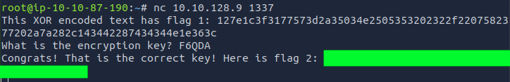
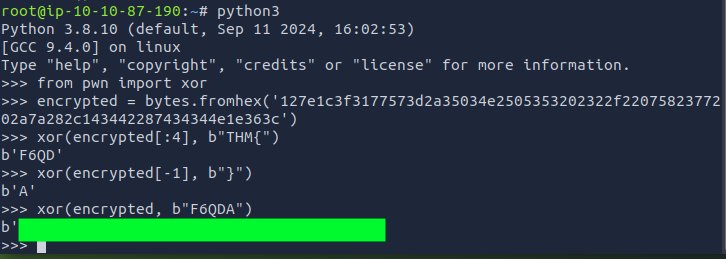

# W1seGuy
# Summary
Suggested as a 5-min challenge, I ended up spending 1 hour solving it...and an additional hour collecting my thoughts and understanding what I did, why it worked, and how XOR works generally, and specifically in this challenge.

## Task 1 Source Code
> Yes, it's me again with another crypto challenge!  
> Have a look at the source code before moving on to Task 2.  
>
> You can review the source code by clicking on the Download Task Files button at the top of this task to download the required file.

The downloadable [task file](./python_source_challenge.py) contains the Python code of the server we need to connect to for completing Task 2.

The script works as follows:
 - The script reads the secret flag from `flag.txt` into a global variable (`flag`).
 - Generates a random, 5-character XOR encryption key (using ASCII letters and digits).
 - XOR-encrypts the flag with this key, hex-encodes it, and sends it as "flag 1".
 - Prompts the user for the key.
 - If entered correctly, "flag 2" is revealed.

## Task 2 Get those flags!
> Your friend told me you were wise, but I don't believe them. Can you prove me wrong?
>
>When you are ready, click the Start Machine button to fire up the Virtual Machine. Please allow 3-5 minutes for the VM to start fully.
>
>The server is listening on port 1337 via TCP. You can connect to it using Netcat or any other tool you prefer.

I started the machine, waited a couple of minutes and then connected to the server via `netcat`:
```bash
nc machine_address 1337
```
And was greeted with:
```bash
This XOR encoded text has flag1: 127e1c3f3177573d2a35034e2505353202322f02a7a282C143442287434344e1e363c
What is the encryption key? 
```
Well, looking at the code, I could clearly see the flow of the script, but I was initially at a loss. I broadly knew what XOR is, but that's it, I had never gone deeper than just using online tools.
Because of this lack of knowledge, I struggled and went on a search to really understand what was going on behind the scenes.

I read some writeups and watched a couple of videos, but the most helpful resources for me were:
1. https://jaxafed.github.io/posts/tryhackme-w1seguy/
2. https://youtu.be/MsgK5iLvT8k?si=_AiXWPNTIxpfpk8H

## Solving with Python
After this, I finally understood how to solve this challenge and why it worked.  

The quickest way was using the python shell:
- Step 1: Recoverinbg a partial key:
```python
>>> from pwn import xor
>>> encrypted = bytes.fromhex('127e1c3f3177573d2a35034e2505353202322f2207582377202a7a282C143442287434344e1e363c')
>>> xor(encrypted[:4], b"THM{") # Encrypted_Flag(first 4 bytes) XOR Partial Flag
b'F60D' # Partial key
```
- Step 2: Finding the last key character  
Since the key is shorter than the flag, it is reused every 5 characters. The flag lenght is ***40***, so we can assume that XORing the last bracket `}` with the last byte of the encrypted flag will give us the last key character:
```bash
>>> xor (encrypted[-1], b"}") # Last byte of the encrypted flag XOR Partial flag
b'A' # Last piece of the key
```
- Step 3: Decrypting  
Now the full key is revelead: `b"F6QDA"`.  
Using this, I obtained **flag 2** and decrypted **flag 1**:
```bash
>>> xor (encrypted, b"F6QDA" )
b'THM{redacted_flag}'
```

## XOR Concept - A brief explanation
In short, the XOR operation is his *own inverse*, hence is reversible. Knowing any two variables allows you to obtain the third:
- **A XOR B = C**, but it is also true that:
    - A XOR C = B
    - B XOR C = A

In this challenge we knew:
- ***C*** --> the encrypted flag
- ***A*** --> the first 4 characters of the flag `THM{`

The key, ***B***, was therefore obtainable bei doing **C XOR A = B**. 

## Understanding XOR, Hex, and Bytes
Even after solving the challenge, I wanted to better understand XOR, hex, and bytes a bit more (pun intended), so I did some heavy googling.

Basically the XOR operation works at the *bitwise* level, not at the character representation level. Here's how:

1. Numeric representation:
    - The first two characters of the encrypted hex string `12...` represent the first byte `0x12` which is `00010010` in binary.
        - Hex -> Bytes -> Binary
        - `12` -> `0x12`-> `00010010`
    - The first character of the partial Flag is `b'T'`, which has a hexadecimal ASCII value of `0x54`, or `01010100` in binary.
        - ASCII -> Hex -> Bytes -> Binary
        - `T` -> `54` -> `0x54` -> `01010100`

2. The XOR operation is then done bitwise:
```bash
00010010    # 0x12
XOR
01010100    # 0x54
--------    
01000110    # 0x46
```

3. The result `01000110` is then converted back to byte, `0x46`, which, corresponds to the ASCII character `F`. 

4. This process is then repeated for all bytes in sequence.

## Fazit
The XOR operation operates implicitly at the binary (bit) level on the numeric value of each byte.

When performing XOR on two bytes objects in Python (or other languages), the system performs the following for each corresponding byte:
1. **Value Retrieval**: looks up the integer value of each byte.
2. **Binary Conversion**: converts those integers to 8-bit binary representations.
3. **Bitwise Operation**: Performs XOR on each pair of corresponding bits.
4. **Result Conversion**: Converts the resulting binary pattern back to an integer, producing the resulting byte.

## Screenshots




